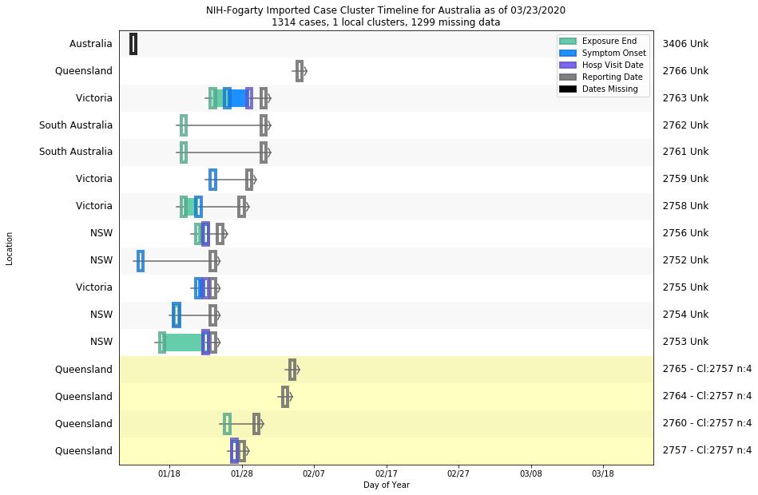

# Australia
## NSSAC COVID-19 Summary
## 03/25/2020

### Situation Report:
#### Fig 1:

[Merged data csv](https://github.com/SchlittDataSci/SchlittDataSci.github.io/blob/master/data/tables/Australia_merged_daily.csv)

#### Table 1: Situation summary

|                           | JHU                         | Tencent                       | NIHFogarty       |
|---------------------------|-----------------------------|-------------------------------|------------------|
| First update logged       | 01/22/20                    | 02/04/20                      | 01/13/20         |
| Last update logged        | 03/23/20                    | 03/17/20                      | 03/13/20         |
| Method                    | Cases by day & country list | Daily cases in country scrape | Public line list |
| First known case          | 01/22/20                    | 02/04/20                      | 01/25/20         |
| Total confirmed cases     | 1314                        | 23                            | 15               |
| New cases since yesterday | 0                           |                               |                  |
| Total suspected           |                             | 0                             |                  |
| Total hospitalized        |                             |                               | 5                |
| Total recovered           | 88                          | 15                            |                  |
| Total deaths              | 7                           | 0                             | 0                |

Data sources: JHU, NIH-Fogarty, Tencent

[Sitrep csv](https://github.com/SchlittDataSci/SchlittDataSci.github.io/blob/master/data/tables/Australia_sitrep.csv)

### Geographic dispersal:
#### Fig 2:

#### Table 2: Confirmed cases by location

| source   | loc_name                     |   confirmed |
|----------|------------------------------|-------------|
| NIH      | Queensland                   |           5 |
| NIH      | Victoria                     |           4 |
| NIH      | NSW                          |           4 |
| NIH      | South Australia              |           2 |
| JHU      | New South Wales              |         533 |
| JHU      | Victoria                     |         296 |
| JHU      | Queensland                   |         221 |
| JHU      | Western Australia            |         120 |
| JHU      | South Australia              |         100 |
| JHU      | Tasmania                     |          22 |
| JHU      | Australian Capital Territory |          19 |
| JHU      | Northern Territory           |           3 |
| JHU      | From Diamond Princess        |           0 |
| BOP      | Australia                    |           1 |

Data sources: BOP, JHU, Natural Earth, NIH-Fogarty, Tencent

[Case points geojson](https://github.com/SchlittDataSci/SchlittDataSci.github.io/blob/master/data/shapes/Australia_case_locs.geojson)

[Case admin1 locs geojson](https://github.com/SchlittDataSci/SchlittDataSci.github.io/blob/master/data/shapes/Australia_admin1_locs.geojson)

### Observed case clusters:
#### Fig 3:

Data source: NIH-Fogarty

#### Fig 4:

Data source: NIH-Fogarty

### Data sources:
* **[BOP](https://github.com/beoutbreakprepared/nCoV2019)**
* **[JHU](https://github.com/CSSEGISandData/COVID-19)** 
* **[NIH-Fogarty](https://docs.google.com/spreadsheets/d/1jS24DjSPVWa4iuxuD4OAXrE3QeI8c9BC1hSlqr-NMiU/edit#gid=1187587451)** 
* **[Tencent](https://news.qq.com/zt2020/page/feiyan.htm)**
* **[Natural Earth](https://www.naturalearthdata.com/forums/forum/natural-earth-map-data/cultural-vectors/admin-1-states-provinces-and-their-boundaries/)**

<!-- Global site tag (gtag.js) - Google Analytics -->

