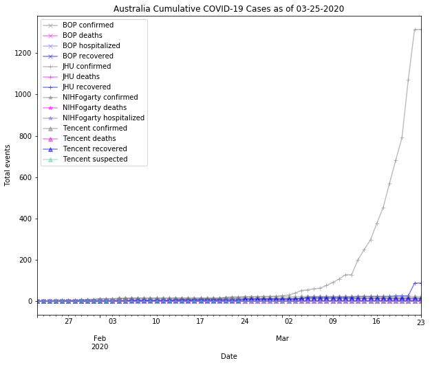
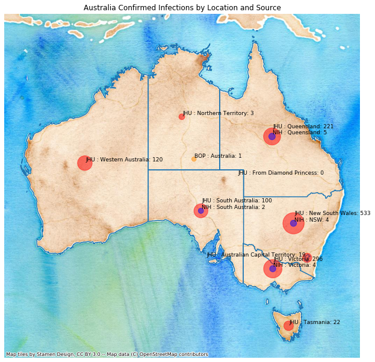

# Australia
## NSSAC COVID-19 Summary
## 03/01/2020

### Situation Report:
#### Fig 1:

[Merged data csv](https://github.com/SchlittDataSci/SchlittDataSci.github.io/blob/master/data/tables/Australia_merged_daily.csv)

#### Table 1: Situation summary

|                           | BOP              | JHU                         | NIHFogarty       | Tencent                       |
|---------------------------|------------------|-----------------------------|------------------|-------------------------------|
| First update logged       | 01/12/20         | 01/22/20                    | 01/13/20         | 02/04/20                      |
| Last update logged        | 02/29/20         | 02/29/20                    | 02/28/20         | 02/24/20                      |
| Method                    | Public line list | Cases by day & country list | Public line list | Daily cases in country scrape |
| First known case          | 01/25/20         | 01/22/20                    | 01/25/20         | 02/04/20                      |
| Total confirmed cases     | 25               | 25                          | 25               | 22                            |
| New cases since yesterday |                  | 2                           |                  |                               |
| Total suspected           |                  |                             |                  | 0                             |
| Total hospitalized        | 5                |                             | 5                |                               |
| Total recovered           | 0                | 11                          |                  | 10                            |
| Total deaths              | 0                | 0                           | 0                | 0                             |

Data sources: BOP, JHU, NIH-Fogarty, Tencent

[Sitrep csv](https://github.com/SchlittDataSci/SchlittDataSci.github.io/blob/master/data/tables/Australia_sitrep.csv)

### Geographic dispersal:
#### Fig 2:

#### Table 2: Confirmed cases by location

| source   | loc_name                         |   confirmed |
|----------|----------------------------------|-------------|
| NIH      | Queensland, Australia            |           5 |
| NIH      | NSW, Australia                   |           4 |
| NIH      | Victoria, Australia              |           4 |
| NIH      | South Australia, Australia       |           2 |
| JHU      | Queensland, Australia            |           9 |
| JHU      | Victoria, Australia              |           7 |
| JHU      | New South Wales, Australia       |           4 |
| JHU      | South Australia, Australia       |           3 |
| JHU      | Western Australia, Australia     |           2 |
| JHU      | From Diamond Princess, Australia |           0 |
| BOP      | Queensland, Australia            |           5 |
| BOP      | New South Wales, Australia       |           4 |
| BOP      | Victoria, Australia              |           4 |
| BOP      | South Australia, Australia       |           2 |

Data sources: BOP, JHU, Natural Earth, NIH-Fogarty, Tencent

[Case points geojson](https://github.com/SchlittDataSci/SchlittDataSci.github.io/blob/master/data/shapes/Australia_case_locs.geojson)

[Case admin1 locs geojson](https://github.com/SchlittDataSci/SchlittDataSci.github.io/blob/master/data/shapes/Australia_admin1_locs.geojson)

### Observed case clusters:
#### Fig 3:

Data source: NIH-Fogarty

#### Fig 4:

Data source: BOP

### Data sources:
* **[BOP](https://github.com/beoutbreakprepared/nCoV2019)**
* **[JHU](https://github.com/CSSEGISandData/COVID-19)** 
* **[NIH-Fogarty](https://docs.google.com/spreadsheets/d/1jS24DjSPVWa4iuxuD4OAXrE3QeI8c9BC1hSlqr-NMiU/edit#gid=1187587451)** 
* **[Tencent](https://news.qq.com/zt2020/page/feiyan.htm)**
* **[Natural Earth](https://www.naturalearthdata.com/forums/forum/natural-earth-map-data/cultural-vectors/admin-1-states-provinces-and-their-boundaries/)**

<!-- Global site tag (gtag.js) - Google Analytics -->

