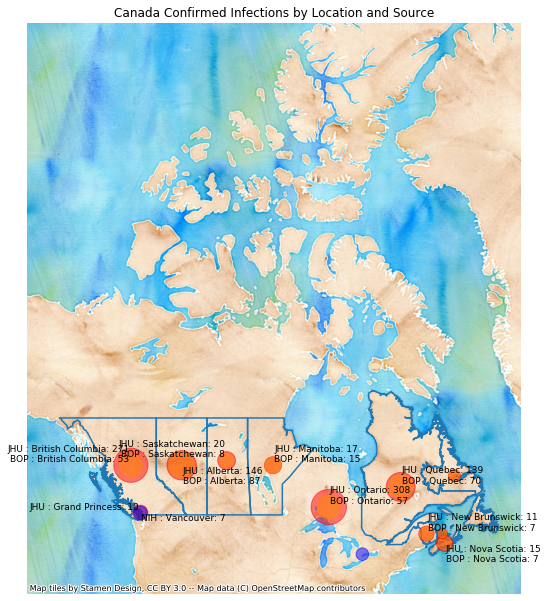

# Canada
## NSSAC COVID-19 Summary
## 02/15/2020

 ### Situation Report:
#### Fig 1:

#### Table 1: Situation summary
|                           | BOP              | JHU                         | Tencent                       |
|---------------------------|------------------|-----------------------------|-------------------------------|
| First update logged       | 01/12/20         | 01/21/20                    | 02/04/20                      |
| Last update logged        | 02/06/20         | 02/14/20                    | 02/15/20                      |
| Method                    | Public line list | Cases by day & country list | Daily cases in country scrape |
| First known case          | 01/25/20         | 01/21/20                    | 02/04/20                      |
| Total confirmed cases     | 5                | 7                           | 8                             |
| New cases since yesterday |                  |                             | 0                             |
| Total suspected           |                  |                             | 0                             |
| Total hospitalized        | 3                |                             |                               |
| Total recovered           | 1                | 1                           | 1                             |
| Total deaths              | 0                | 0                           | 0                             |
Data sources: BOP, JHU, Tencent

### Geographic dispersal:
#### Fig 2:

#### Table 2: Confirmed cases by location
|    | source   | loc_name                 |   confirmed |
|----|----------|--------------------------|-------------|
|  5 | Tencent  | Canada                   |           8 |
|  1 | JHU      | British Columbia, Canada |           4 |
|  0 | JHU      | Toronto, ON, Canada      |           2 |
|  2 | JHU      | London, ON, Canada       |           1 |
|  3 | BOP      | Ontario, Canada          |           3 |
|  4 | BOP      | British Columbia, Canada |           2 |

Data sources: BOP, JHU, Tencent

### Observed case clusters:
#### Fig 3:

Data source: BOP

### Data sources:
* **BOP:** https://github.com/beoutbreakprepared/nCoV2019
* **JHU:** https://github.com/CSSEGISandData/COVID-19/issues
* **Tencent:** https://news.qq.com/zt2020/page/feiyan.htm