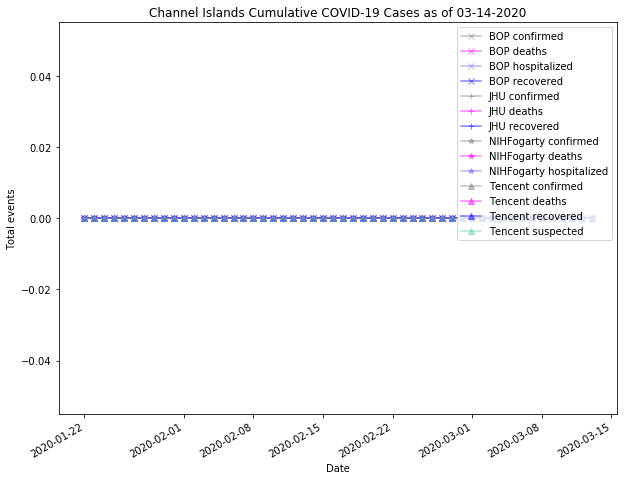
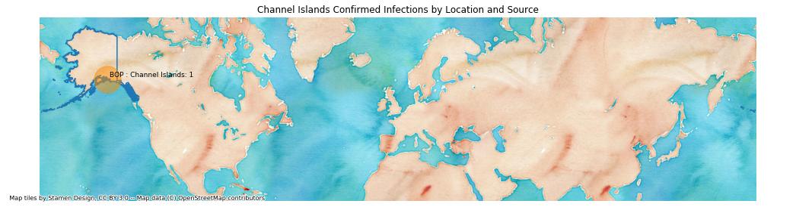

# Channel Islands
## NSSAC COVID-19 Summary
## 03/13/2020

### Situation Report:
#### Fig 1:

[Merged data csv](https://github.com/SchlittDataSci/SchlittDataSci.github.io/blob/master/data/tables/Channel_Islands_merged_daily.csv)

#### Table 1: Situation summary

|---------------------------|
| First update logged       |
| Last update logged        |
| Method                    |
| First known case          |
| Total confirmed cases     |
| New cases since yesterday |
| Total suspected           |
| Total hospitalized        |
| Total recovered           |
| Total deaths              |

Data sources: JHU, 

[Sitrep csv](https://github.com/SchlittDataSci/SchlittDataSci.github.io/blob/master/data/tables/Channel_Islands_sitrep.csv)

### Geographic dispersal:
#### Fig 2:

#### Table 2: Confirmed cases by location

| source   | loc_name        |   confirmed |
|----------|-----------------|-------------|
| BOP      | Channel Islands |           1 |

Data sources: BOP, JHU, Natural Earth, Tencent

[Case points geojson](https://github.com/SchlittDataSci/SchlittDataSci.github.io/blob/master/data/shapes/Channel_Islands_case_locs.geojson)

[Case admin1 locs geojson](https://github.com/SchlittDataSci/SchlittDataSci.github.io/blob/master/data/shapes/Channel_Islands_admin1_locs.geojson)

### Observed case clusters:
### Data sources:
* **[BOP](https://github.com/beoutbreakprepared/nCoV2019)**
* **[JHU](https://github.com/CSSEGISandData/COVID-19)** 
* **[NIH-Fogarty](https://docs.google.com/spreadsheets/d/1jS24DjSPVWa4iuxuD4OAXrE3QeI8c9BC1hSlqr-NMiU/edit#gid=1187587451)** 
* **[Tencent](https://news.qq.com/zt2020/page/feiyan.htm)**
* **[Natural Earth](https://www.naturalearthdata.com/forums/forum/natural-earth-map-data/cultural-vectors/admin-1-states-provinces-and-their-boundaries/)**

<!-- Global site tag (gtag.js) - Google Analytics -->

