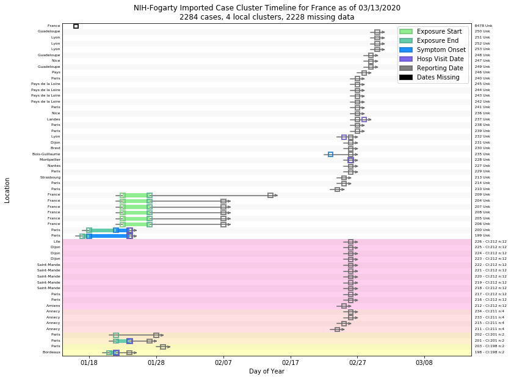
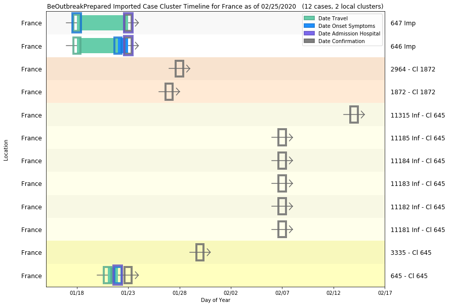
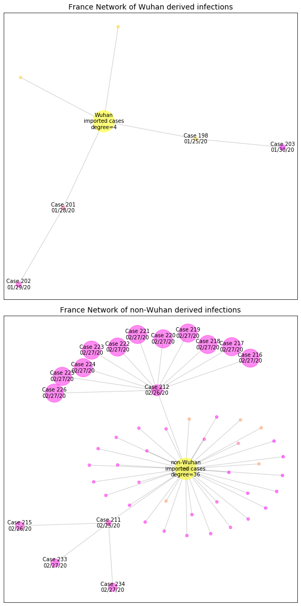

# France
## NSSAC COVID-19 Summary
## 03/04/2020

### Situation Report:
#### Fig 1:

[Merged data csv](https://github.com/SchlittDataSci/SchlittDataSci.github.io/blob/master/data/tables/France_merged_daily.csv)

#### Table 1: Situation summary

|                           | JHU                         | NIHFogarty       | BOP              | Tencent                       |
|---------------------------|-----------------------------|------------------|------------------|-------------------------------|
| First update logged       | 01/22/20                    | 01/13/20         | 01/12/20         | 02/04/20                      |
| Last update logged        | 03/03/20                    | 03/04/20         | 03/04/20         | 03/04/20                      |
| Method                    | Cases by day & country list | Public line list | Public line list | Daily cases in country scrape |
| First known case          | 01/22/20                    | 01/25/20         | 01/24/20         | 02/04/20                      |
| Total confirmed cases     | 204                         | 56               | 40               | 38                            |
| New cases since yesterday |                             |                  |                  | 0                             |
| Total suspected           |                             |                  |                  | 0                             |
| Total hospitalized        |                             | 7                | 3                |                               |
| Total recovered           | 12                          |                  | 0                | 12                            |
| Total deaths              | 4                           | 0                | 1                | 2                             |

Data sources: BOP, JHU, NIH-Fogarty, Tencent

[Sitrep csv](https://github.com/SchlittDataSci/SchlittDataSci.github.io/blob/master/data/tables/France_sitrep.csv)

### Geographic dispersal:
#### Fig 2:

#### Table 2: Confirmed cases by location

| source   | loc_name                     |   confirmed |
|----------|------------------------------|-------------|
| NIH      | Paris, France                |          14 |
| NIH      | Saint-Mande, France          |           5 |
| NIH      | Lyon, France                 |           4 |
| NIH      | Pays de la Loire, France     |           4 |
| NIH      | Dijon, France                |           4 |
| NIH      | Annecy, France               |           4 |
| NIH      | Guadeloupe, France           |           3 |
| NIH      | Nice, France                 |           2 |
| NIH      | Amiens, France               |           1 |
| NIH      | Lile, France                 |           1 |
| NIH      | Nantes, France               |           1 |
| NIH      | Strasbourg, France           |           1 |
| NIH      | Landes, France               |           1 |
| NIH      | Bois-Guillaume, France       |           1 |
| NIH      | Montpellier, France          |           1 |
| NIH      | Pays, France                 |           1 |
| NIH      | Bordeaux, France             |           1 |
| NIH      | Brest, France                |           1 |
| JHU      | France                       |         204 |
| BOP      | Auvergne-Rhone-Alpes, France |           9 |
| BOP      | Ile-de-France, France        |           6 |
| BOP      | Nouvelle-Aquitaine, France   |           1 |
| BOP      | Brittany, France             |           1 |
| BOP      | Grand Est, France            |           1 |
| BOP      | Hauts-de-France, France      |           1 |

Data sources: BOP, JHU, Natural Earth, NIH-Fogarty, Tencent

[Case points geojson](https://github.com/SchlittDataSci/SchlittDataSci.github.io/blob/master/data/shapes/France_case_locs.geojson)

[Case admin1 locs geojson](https://github.com/SchlittDataSci/SchlittDataSci.github.io/blob/master/data/shapes/France_admin1_locs.geojson)

### Observed case clusters:
#### Fig 3:

Data source: NIH-Fogarty

#### Fig 4:

Data source: BOP

#### Fig 5:

Data source: NIH-Fogarty

### Data sources:
* **[BOP](https://github.com/beoutbreakprepared/nCoV2019)**
* **[JHU](https://github.com/CSSEGISandData/COVID-19)** 
* **[NIH-Fogarty](https://docs.google.com/spreadsheets/d/1jS24DjSPVWa4iuxuD4OAXrE3QeI8c9BC1hSlqr-NMiU/edit#gid=1187587451)** 
* **[Tencent](https://news.qq.com/zt2020/page/feiyan.htm)**
* **[Natural Earth](https://www.naturalearthdata.com/forums/forum/natural-earth-map-data/cultural-vectors/admin-1-states-provinces-and-their-boundaries/)**

<!-- Global site tag (gtag.js) - Google Analytics -->

