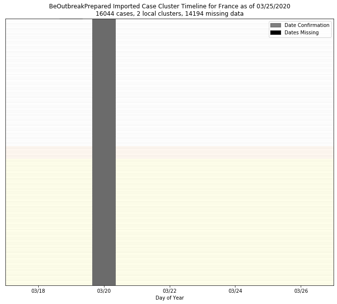

# France
## NSSAC COVID-19 Summary
## 03/17/2020

### Situation Report:
#### Fig 1:

[Merged data csv](https://github.com/SchlittDataSci/SchlittDataSci.github.io/blob/master/data/tables/France_merged_daily.csv)

#### Table 1: Situation summary

|                           | JHU                         | BOP              | NIHFogarty       | Tencent                       |
|---------------------------|-----------------------------|------------------|------------------|-------------------------------|
| First update logged       | 01/22/20                    | 01/06/20         | 01/13/20         | 02/04/20                      |
| Last update logged        | 03/16/20                    | 03/16/20         | 03/13/20         | 03/17/20                      |
| Method                    | Cases by day & country list | Public line list | Public line list | Daily cases in country scrape |
| First known case          | 01/22/20                    | 01/24/20         | 01/25/20         | 02/04/20                      |
| Total confirmed cases     | 6659                        | 2859             | 56               | 38                            |
| New cases since yesterday |                             |                  |                  |                               |
| Total suspected           |                             |                  |                  | 0                             |
| Total hospitalized        |                             | 9                | 7                |                               |
| Total recovered           | 12                          | 2                |                  | 12                            |
| Total deaths              | 148                         | 1                | 0                | 2                             |

Data sources: BOP, JHU, NIH-Fogarty, Tencent

[Sitrep csv](https://github.com/SchlittDataSci/SchlittDataSci.github.io/blob/master/data/tables/France_sitrep.csv)

### Geographic dispersal:
#### Fig 2:

#### Table 2: Confirmed cases by location

| source   | loc_name                   |   confirmed |
|----------|----------------------------|-------------|
| NIH      | Paris                      |          14 |
| NIH      | Saint-Mande                |           5 |
| NIH      | Lyon                       |           4 |
| NIH      | Annecy                     |           4 |
| NIH      | Pays de la Loire           |           4 |
| NIH      | Dijon                      |           4 |
| NIH      | Guadeloupe                 |           3 |
| NIH      | Nice                       |           2 |
| NIH      | Bois-Guillaume             |           1 |
| NIH      | Pays                       |           1 |
| NIH      | Montpellier                |           1 |
| NIH      | Lile                       |           1 |
| NIH      | Bordeaux                   |           1 |
| NIH      | Nantes                     |           1 |
| NIH      | Amiens                     |           1 |
| NIH      | Strasbourg                 |           1 |
| NIH      | Landes                     |           1 |
| NIH      | Brest                      |           1 |
| JHU      | France                     |        6633 |
| JHU      | French Guiana              |          11 |
| JHU      | Guadeloupe                 |           6 |
| JHU      | Saint Barthelemy           |           3 |
| JHU      | French Polynesia           |           3 |
| JHU      | St Martin                  |           2 |
| JHU      | Mayotte                    |           1 |
| BOP      | Grand Est                  |         699 |
| BOP      | Ile-de-France              |         577 |
| BOP      | Hauts-de-France            |         349 |
| BOP      | Auvergne-Rhone-Alpes       |         329 |
| BOP      | Bourgogne-Franche-Comte    |         219 |
| BOP      | Provence-Alpes-Cote d'Azur |         147 |
| BOP      | Occitanie                  |         133 |
| BOP      | Bretagne                   |         116 |
| BOP      | Nouvelle-Aquitaine         |          87 |
| BOP      | Normandie                  |          68 |
| BOP      | Corse                      |          64 |
| BOP      | Pays de la Loire           |          40 |
| BOP      | Centre-Val de Loire        |          30 |
| BOP      | Brittany                   |           1 |

Data sources: BOP, JHU, Natural Earth, NIH-Fogarty, Tencent

[Case points geojson](https://github.com/SchlittDataSci/SchlittDataSci.github.io/blob/master/data/shapes/France_case_locs.geojson)

[Case admin1 locs geojson](https://github.com/SchlittDataSci/SchlittDataSci.github.io/blob/master/data/shapes/France_admin1_locs.geojson)

### Observed case clusters:
#### Fig 3:

Data source: NIH-Fogarty

#### Fig 4:

Data source: BOP

#### Fig 5:

Data source: NIH-Fogarty

### Data sources:
* **[BOP](https://github.com/beoutbreakprepared/nCoV2019)**
* **[JHU](https://github.com/CSSEGISandData/COVID-19)** 
* **[NIH-Fogarty](https://docs.google.com/spreadsheets/d/1jS24DjSPVWa4iuxuD4OAXrE3QeI8c9BC1hSlqr-NMiU/edit#gid=1187587451)** 
* **[Tencent](https://news.qq.com/zt2020/page/feiyan.htm)**
* **[Natural Earth](https://www.naturalearthdata.com/forums/forum/natural-earth-map-data/cultural-vectors/admin-1-states-provinces-and-their-boundaries/)**

<!-- Global site tag (gtag.js) - Google Analytics -->

