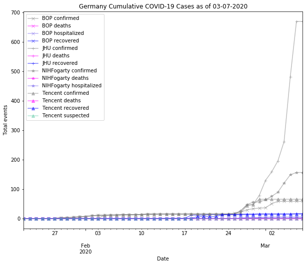
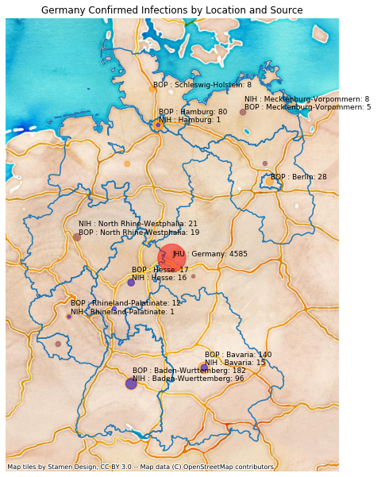
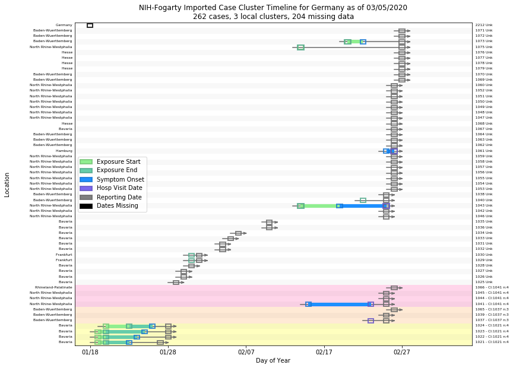
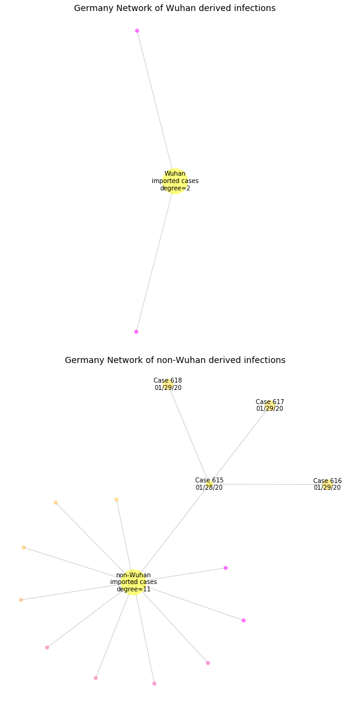

# Germany
## NSSAC COVID-19 Summary
## 03/12/2020

### Situation Report:
#### Fig 1:

[Merged data csv](https://github.com/SchlittDataSci/SchlittDataSci.github.io/blob/master/data/tables/Germany_merged_daily.csv)

#### Table 1: Situation summary

|                           | JHU                         | BOP              | NIHFogarty       | Tencent                       |
|---------------------------|-----------------------------|------------------|------------------|-------------------------------|
| First update logged       | 01/22/20                    | 01/12/20         | 01/13/20         | 02/04/20                      |
| Last update logged        | 03/10/20                    | 03/09/20         | 03/11/20         | 03/11/20                      |
| Method                    | Cases by day & country list | Public line list | Public line list | Daily cases in country scrape |
| First known case          | 01/22/20                    | 01/27/20         | 01/28/20         | 02/04/20                      |
| Total confirmed cases     | 1457                        | 444              | 168              | 66                            |
| New cases since yesterday |                             |                  |                  | 0                             |
| Total suspected           |                             |                  |                  | 0                             |
| Total hospitalized        |                             | 5                | 5                |                               |
| Total recovered           | 18                          | 1                |                  | 16                            |
| Total deaths              | 2                           | 0                | 0                | 0                             |

Data sources: BOP, JHU, NIH-Fogarty, Tencent

[Sitrep csv](https://github.com/SchlittDataSci/SchlittDataSci.github.io/blob/master/data/tables/Germany_sitrep.csv)

### Geographic dispersal:
#### Fig 2:

#### Table 2: Confirmed cases by location

| source   | loc_name               |   confirmed |
|----------|------------------------|-------------|
| NIH      | Baden-Wuerttemberg     |          96 |
| NIH      | North Rhine-Westphalia |          21 |
| NIH      | Hesse                  |          16 |
| NIH      | Bavaria                |          15 |
| NIH      | Mecklenburg-Vorpommern |           8 |
| NIH      | Saarland               |           5 |
| NIH      | Frankfurt              |           2 |
| NIH      | Brandenburg            |           2 |
| NIH      | Rhineland-Palatinate   |           1 |
| NIH      | Thuringia              |           1 |
| NIH      | Hamburg                |           1 |
| JHU      | Germany                |        1457 |
| BOP      | Baden-Wurttemberg      |         182 |
| BOP      | Bavaria                |         140 |
| BOP      | Berlin                 |          28 |
| BOP      | North Rhine-Westphalia |          19 |
| BOP      | Hesse                  |          17 |
| BOP      | Hamburg                |          17 |
| BOP      | Rhineland-Palatinate   |          12 |
| BOP      | Lower Saxony           |           9 |
| BOP      | Schleswig-Holstein     |           8 |
| BOP      | Mecklenburg-Vorpommern |           5 |
| BOP      | Saarland               |           4 |
| BOP      | Thuringia              |           1 |
| BOP      | Brandenburg            |           1 |

Data sources: BOP, JHU, Natural Earth, NIH-Fogarty, Tencent

[Case points geojson](https://github.com/SchlittDataSci/SchlittDataSci.github.io/blob/master/data/shapes/Germany_case_locs.geojson)

[Case admin1 locs geojson](https://github.com/SchlittDataSci/SchlittDataSci.github.io/blob/master/data/shapes/Germany_admin1_locs.geojson)

### Observed case clusters:
#### Fig 3:

Data source: NIH-Fogarty

#### Fig 4:

Data source: BOP

#### Fig 5:

Data source: NIH-Fogarty

### Data sources:
* **[BOP](https://github.com/beoutbreakprepared/nCoV2019)**
* **[JHU](https://github.com/CSSEGISandData/COVID-19)** 
* **[NIH-Fogarty](https://docs.google.com/spreadsheets/d/1jS24DjSPVWa4iuxuD4OAXrE3QeI8c9BC1hSlqr-NMiU/edit#gid=1187587451)** 
* **[Tencent](https://news.qq.com/zt2020/page/feiyan.htm)**
* **[Natural Earth](https://www.naturalearthdata.com/forums/forum/natural-earth-map-data/cultural-vectors/admin-1-states-provinces-and-their-boundaries/)**

<!-- Global site tag (gtag.js) - Google Analytics -->

