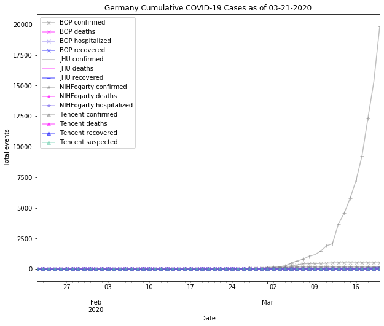

# Germany
## NSSAC COVID-19 Summary
## 02/14/2020

 ### Situation Report:
#### Fig 1:

#### Table 1: Situation summary
|                           | BOP              | JHU                         | Tencent                       |
|---------------------------|------------------|-----------------------------|-------------------------------|
| First update logged       | 01/12/20         | 01/21/20                    | 02/04/20                      |
| Last update logged        | 02/06/20         | 02/14/20                    | 02/14/20                      |
| Method                    | Public line list | Cases by day & country list | Daily cases in country scrape |
| First known case          | 01/27/20         | 01/21/20                    | 02/04/20                      |
| Total confirmed cases     | 13               | 16                          | 16                            |
| New cases since yesterday |                  | 0                           | 0                             |
| Total suspected           |                  |                             | 0                             |
| Total hospitalized        | 0                |                             |                               |
| Total recovered           | 1                | 1                           | 1                             |
| Total deaths              | 0                | 0                           | 0                             |
Data sources: BOP, JHU, Tencent

### Geographic dispersal:
#### Fig 2:

#### Table 2: Confirmed cases by location
|    | source   | loc_name                      |   confirmed |
|----|----------|-------------------------------|-------------|
|  3 | Tencent  | Germany                       |          16 |
|  0 | JHU      | Germany                       |          16 |
|  1 | BOP      | Bavaria, Germany              |           9 |
|  2 | BOP      | Rhineland-Palatinate, Germany |           2 |

Data sources: BOP, JHU, Tencent

### Observed case clusters:
#### Fig 3:

Data source: BOP

### Data sources:
* **BOP:** https://github.com/beoutbreakprepared/nCoV2019
* **JHU:** https://github.com/CSSEGISandData/COVID-19/issues
* **Tencent:** https://news.qq.com/zt2020/page/feiyan.htm
    
    
    
    
    
THE CONTENTS OF THIS WEBSITE, INCLUDING DATA, MAPS, PLOTS, COPYRIGHT 2020, UVA, ALL RIGHTS RESERVED, IS PROVIDED TO THE PUBLIC FOR RESEARCH AND ACADEMIC PURPOSES. THE WEBSITE USES A NUMBER OF OPEN SOURCE DATA SETS. UVA PROVIDES NO WARRANTIES, CLAIMS OR REPRESENTATIONS–WHETHER EXPRESS, IMPLIED, OR STATUTORY–WITH RESPECT TO THIS WEBSITE, INCLUDING, WITHOUT LIMITATION, WARRANTIES OF QUALITY, PERFORMANCE, NON–INFRINGEMENT, MERCHANTABILITY, OR FITNESS FOR A PARTICULAR PURPOSE, AND DISAVOWS ANY WARRANTIES CREATED BY COURSE OF DEALING, COURSE OF PERFORMANCE, OR TRADE USAGE.