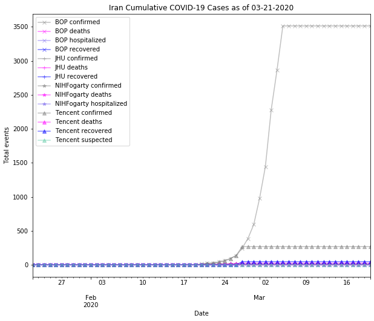

# Iran
## NSSAC COVID-19 Summary
## 03/11/2020

### Situation Report:
#### Fig 1:

[Merged data csv](https://github.com/SchlittDataSci/SchlittDataSci.github.io/blob/master/data/tables/Iran_merged_daily.csv)

#### Table 1: Situation summary

|                           | BOP              | Tencent                       | NIHFogarty       |
|---------------------------|------------------|-------------------------------|------------------|
| First update logged       | 01/12/20         | 02/20/20                      | 01/13/20         |
| Last update logged        | 03/04/20         | 03/11/20                      | 03/10/20         |
| Method                    | Public line list | Daily cases in country scrape | Public line list |
| First known case          | 02/19/20         | 02/20/20                      | 02/19/20         |
| Total confirmed cases     | 995              | 270                           | 18               |
| New cases since yesterday |                  | 0                             |                  |
| Total suspected           |                  | 0                             |                  |
| Total hospitalized        | 0                |                               | 0                |
| Total recovered           | 0                | 49                            |                  |
| Total deaths              | 0                | 26                            | 0                |

Data sources: BOP, JHU, NIH-Fogarty, Tencent

[Sitrep csv](https://github.com/SchlittDataSci/SchlittDataSci.github.io/blob/master/data/tables/Iran_sitrep.csv)

### Geographic dispersal:
#### Fig 2:

#### Table 2: Confirmed cases by location

| source   | loc_name                   |   confirmed |
|----------|----------------------------|-------------|
| NIH      | Qom                        |          11 |
| NIH      | Tehran                     |           4 |
| NIH      | Guilan                     |           2 |
| NIH      | Araq                       |           1 |
| BOP      | Tehran                     |         354 |
| BOP      | Qom                        |         139 |
| BOP      | Gilan                      |         112 |
| BOP      | Markazi                    |          68 |
| BOP      | Alborz                     |          47 |
| BOP      | Esfahan                    |          45 |
| BOP      | Mazandaran                 |          43 |
| BOP      | Golestan                   |          24 |
| BOP      | Fars                       |          19 |
| BOP      | Razavi Khorasan            |          19 |
| BOP      | Khuzestan                  |          19 |
| BOP      | Semnan                     |          13 |
| BOP      | East Azarbaijan            |          12 |
| BOP      | Lorestan                   |          12 |
| BOP      | Ardebil                    |          10 |
| BOP      | Qazvin                     |           8 |
| BOP      | Kordestan                  |           8 |
| BOP      | Kermanshah                 |           5 |
| BOP      | Yazd                       |           5 |
| BOP      | Hamadan                    |           5 |
| BOP      | Hormozgan                  |           4 |
| BOP      | Sistan and Baluchestan     |           4 |
| BOP      | South Khorasan             |           3 |
| BOP      | Kerman                     |           2 |
| BOP      | Ilam                       |           2 |
| BOP      | Kohgiluyeh and Buyer Ahmad |           2 |
| BOP      | West Azarbaijan            |           1 |

Data sources: BOP, JHU, Natural Earth, NIH-Fogarty, Tencent

[Case points geojson](https://github.com/SchlittDataSci/SchlittDataSci.github.io/blob/master/data/shapes/Iran_case_locs.geojson)

[Case admin1 locs geojson](https://github.com/SchlittDataSci/SchlittDataSci.github.io/blob/master/data/shapes/Iran_admin1_locs.geojson)

### Observed case clusters:
#### Fig 3:

Data source: NIH-Fogarty

#### Fig 4:

Data source: BOP

#### Fig 5:

Data source: NIH-Fogarty

### Data sources:
* **[BOP](https://github.com/beoutbreakprepared/nCoV2019)**
* **[JHU](https://github.com/CSSEGISandData/COVID-19)** 
* **[NIH-Fogarty](https://docs.google.com/spreadsheets/d/1jS24DjSPVWa4iuxuD4OAXrE3QeI8c9BC1hSlqr-NMiU/edit#gid=1187587451)** 
* **[Tencent](https://news.qq.com/zt2020/page/feiyan.htm)**
* **[Natural Earth](https://www.naturalearthdata.com/forums/forum/natural-earth-map-data/cultural-vectors/admin-1-states-provinces-and-their-boundaries/)**

<!-- Global site tag (gtag.js) - Google Analytics -->

