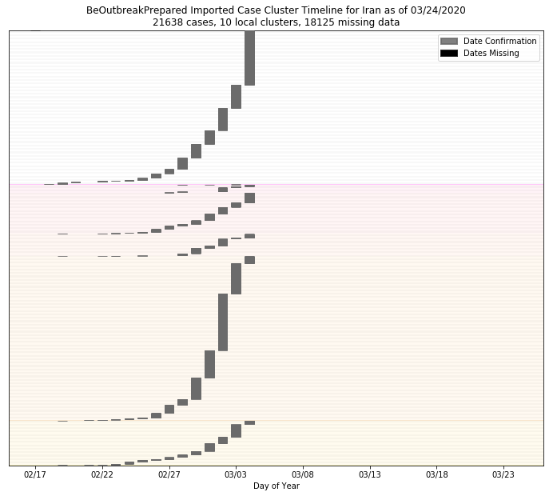
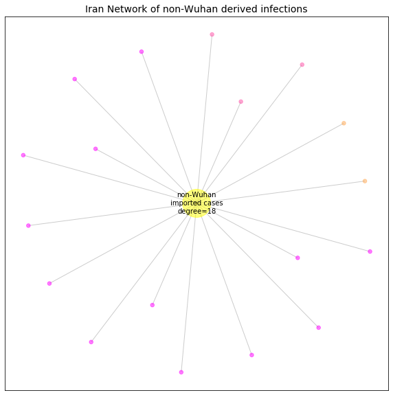

# Iran
## NSSAC COVID-19 Summary
## 03/04/2020

### Situation Report:
#### Fig 1:

[Merged data csv](https://github.com/SchlittDataSci/SchlittDataSci.github.io/blob/master/data/tables/Iran_merged_daily.csv)

#### Table 1: Situation summary

|                           | JHU                         | BOP              | Tencent                       | NIHFogarty       |
|---------------------------|-----------------------------|------------------|-------------------------------|------------------|
| First update logged       | 01/22/20                    | 01/12/20         | 02/20/20                      | 01/13/20         |
| Last update logged        | 03/03/20                    | 03/04/20         | 03/04/20                      | 03/04/20         |
| Method                    | Cases by day & country list | Public line list | Daily cases in country scrape | Public line list |
| First known case          | 01/22/20                    | 02/19/20         | 02/20/20                      | 02/19/20         |
| Total confirmed cases     | 2336                        | 995              | 270                           | 18               |
| New cases since yesterday |                             |                  | 0                             |                  |
| Total suspected           |                             |                  | 0                             |                  |
| Total hospitalized        |                             | 0                |                               | 0                |
| Total recovered           | 291                         | 0                | 49                            |                  |
| Total deaths              | 77                          | 0                | 26                            | 0                |

Data sources: BOP, JHU, NIH-Fogarty, Tencent

[Sitrep csv](https://github.com/SchlittDataSci/SchlittDataSci.github.io/blob/master/data/tables/Iran_sitrep.csv)

### Geographic dispersal:
#### Fig 2:

#### Table 2: Confirmed cases by location

| source   | loc_name                         |   confirmed |
|----------|----------------------------------|-------------|
| NIH      | Qom, Iran                        |          11 |
| NIH      | Tehran, Iran                     |           4 |
| NIH      | Guilan, Iran                     |           2 |
| NIH      | Araq, Iran                       |           1 |
| JHU      | Iran                             |        2336 |
| BOP      | Tehran, Iran                     |         354 |
| BOP      | Qom, Iran                        |         139 |
| BOP      | Gilan, Iran                      |         112 |
| BOP      | Markazi, Iran                    |          68 |
| BOP      | Alborz, Iran                     |          47 |
| BOP      | Esfahan, Iran                    |          45 |
| BOP      | Mazandaran, Iran                 |          43 |
| BOP      | Golestan, Iran                   |          24 |
| BOP      | Khuzestan, Iran                  |          19 |
| BOP      | Razavi Khorasan, Iran            |          19 |
| BOP      | Fars, Iran                       |          19 |
| BOP      | Semnan, Iran                     |          13 |
| BOP      | Lorestan, Iran                   |          12 |
| BOP      | East Azarbaijan, Iran            |          12 |
| BOP      | Ardebil, Iran                    |          10 |
| BOP      | Qazvin, Iran                     |           8 |
| BOP      | Kordestan, Iran                  |           8 |
| BOP      | Kermanshah, Iran                 |           5 |
| BOP      | Hamadan, Iran                    |           5 |
| BOP      | Yazd, Iran                       |           5 |
| BOP      | Sistan and Baluchestan, Iran     |           4 |
| BOP      | Hormozgan, Iran                  |           4 |
| BOP      | South Khorasan, Iran             |           3 |
| BOP      | Kohgiluyeh and Buyer Ahmad, Iran |           2 |
| BOP      | Ilam, Iran                       |           2 |
| BOP      | Kerman, Iran                     |           2 |
| BOP      | West Azarbaijan, Iran            |           1 |

Data sources: BOP, JHU, Natural Earth, NIH-Fogarty, Tencent

[Case points geojson](https://github.com/SchlittDataSci/SchlittDataSci.github.io/blob/master/data/shapes/Iran_case_locs.geojson)

[Case admin1 locs geojson](https://github.com/SchlittDataSci/SchlittDataSci.github.io/blob/master/data/shapes/Iran_admin1_locs.geojson)

### Observed case clusters:
#### Fig 3:

Data source: NIH-Fogarty

#### Fig 4:

Data source: BOP

#### Fig 5:

Data source: NIH-Fogarty

### Data sources:
* **[BOP](https://github.com/beoutbreakprepared/nCoV2019)**
* **[JHU](https://github.com/CSSEGISandData/COVID-19)** 
* **[NIH-Fogarty](https://docs.google.com/spreadsheets/d/1jS24DjSPVWa4iuxuD4OAXrE3QeI8c9BC1hSlqr-NMiU/edit#gid=1187587451)** 
* **[Tencent](https://news.qq.com/zt2020/page/feiyan.htm)**
* **[Natural Earth](https://www.naturalearthdata.com/forums/forum/natural-earth-map-data/cultural-vectors/admin-1-states-provinces-and-their-boundaries/)**

<!-- Global site tag (gtag.js) - Google Analytics -->

