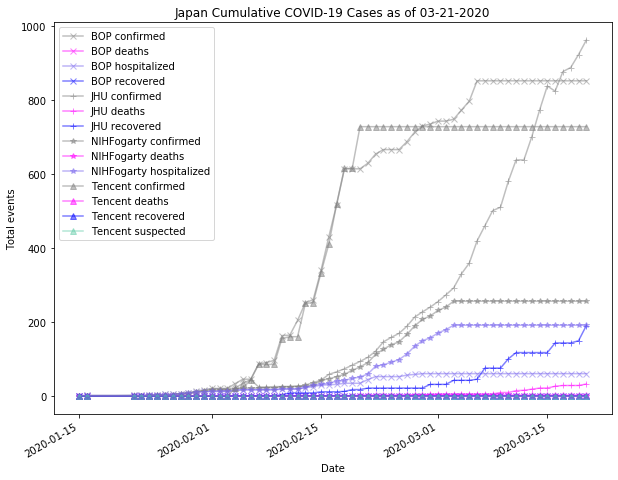
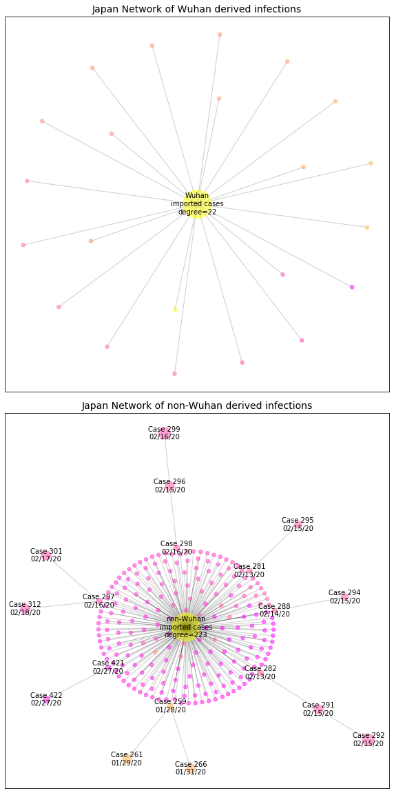

# Japan
## NSSAC COVID-19 Summary
## 03/01/2020

### Situation Report:
#### Fig 1:

[Merged data csv](https://github.com/SchlittDataSci/SchlittDataSci.github.io/blob/master/data/tables/Japan_merged_daily.csv)

#### Table 1: Situation summary

|                           | BOP              | Tencent                       | JHU                         | NIHFogarty       |
|---------------------------|------------------|-------------------------------|-----------------------------|------------------|
| First update logged       | 01/12/20         | 02/04/20                      | 01/22/20                    | 01/13/20         |
| Last update logged        | 02/29/20         | 02/20/20                      | 02/29/20                    | 02/28/20         |
| Method                    | Public line list | Daily cases in country scrape | Cases by day & country list | Public line list |
| First known case          | 01/15/20         | 02/04/20                      | 01/22/20                    | 01/15/20         |
| Total confirmed cases     | 731              | 729                           | 241                         | 241              |
| New cases since yesterday |                  |                               | 13                          |                  |
| Total suspected           |                  | 0                             |                             |                  |
| Total hospitalized        | 62               |                               |                             | 136              |
| Total recovered           | 1                | 1                             | 32                          |                  |
| Total deaths              | 0                | 3                             | 5                           | 0                |

Data sources: BOP, JHU, NIH-Fogarty, Tencent

[Sitrep csv](https://github.com/SchlittDataSci/SchlittDataSci.github.io/blob/master/data/tables/Japan_sitrep.csv)

### Geographic dispersal:
#### Fig 2:

#### Table 2: Confirmed cases by location

| source   | loc_name                   |   confirmed |
|----------|----------------------------|-------------|
| NIH      | Hokkaido, Japan            |          48 |
| NIH      | Tokyo, Japan               |          25 |
| NIH      | Nagoya City, Japan         |          20 |
| NIH      | Wakayama Prefecture, Japan |          12 |
| NIH      | Chiba Prefecture, Japan    |          11 |
| NIH      | Sagamihara, Japan          |           9 |
| NIH      | Kanagawa, Japan            |           7 |
| NIH      | Aichi Prefecture, Japan    |           7 |
| NIH      | Sapporo, Japan             |           5 |
| NIH      | Ishikawa, Japan            |           5 |
| NIH      | Kumamoto City, Japan       |           4 |
| NIH      | Osaka Prefecture, Japan    |           3 |
| NIH      | Okinawa Prefecture, Japan  |           3 |
| NIH      | Nara Prefecture, Japan     |           2 |
| NIH      | Fukuoka Prefecture, Japan  |           2 |
| NIH      | Gifu Prefecture, Japan     |           2 |
| NIH      | Kyoto, Japan               |           2 |
| NIH      | Saitama Prefecture, Japan  |           1 |
| NIH      | Kumamoto Prefecture, Japan |           1 |
| NIH      | Nagano Prefecture, Japan   |           1 |
| NIH      | Haneda, Japan              |           1 |
| NIH      | Mie, Japan                 |           1 |
| JHU      | Japan                      |         241 |
| BOP      | Kanagawa Prefecture, Japan |         557 |
| BOP      | Hokkaido, Japan            |          59 |
| BOP      | Tokyo, Japan               |          34 |
| BOP      | Aichi Prefecture, Japan    |          22 |
| BOP      | Chiba Prefecture, Japan    |          15 |
| BOP      | Wakayama Prefecture, Japan |           9 |
| BOP      | Osaka, Japan               |           5 |
| BOP      | Ishikawa, Japan            |           4 |
| BOP      | Kumamoto, Japan            |           3 |
| BOP      | Saitama, Japan             |           2 |
| BOP      | Gifu, Japan                |           2 |
| BOP      | Kyoto Prefecture, Japan    |           2 |
| BOP      | Kanagawa, Japan            |           2 |
| BOP      | Nagano, Japan              |           1 |
| BOP      | Nara Prefecture, Japan     |           1 |
| BOP      | Okinawa, Japan             |           1 |
| BOP      | Shizuoka, Japan            |           1 |
| BOP      | Mie, Japan                 |           1 |

Data sources: BOP, JHU, Natural Earth, NIH-Fogarty, Tencent

[Case points geojson](https://github.com/SchlittDataSci/SchlittDataSci.github.io/blob/master/data/shapes/Japan_case_locs.geojson)

[Case admin1 locs geojson](https://github.com/SchlittDataSci/SchlittDataSci.github.io/blob/master/data/shapes/Japan_admin1_locs.geojson)

### Observed case clusters:
#### Fig 3:

Data source: NIH-Fogarty

#### Fig 4:

Data source: BOP

#### Fig 5:

Data source: NIH-Fogarty

### Data sources:
* **[BOP](https://github.com/beoutbreakprepared/nCoV2019)**
* **[JHU](https://github.com/CSSEGISandData/COVID-19)** 
* **[NIH-Fogarty](https://docs.google.com/spreadsheets/d/1jS24DjSPVWa4iuxuD4OAXrE3QeI8c9BC1hSlqr-NMiU/edit#gid=1187587451)** 
* **[Tencent](https://news.qq.com/zt2020/page/feiyan.htm)**
* **[Natural Earth](https://www.naturalearthdata.com/forums/forum/natural-earth-map-data/cultural-vectors/admin-1-states-provinces-and-their-boundaries/)**

<!-- Global site tag (gtag.js) - Google Analytics -->

