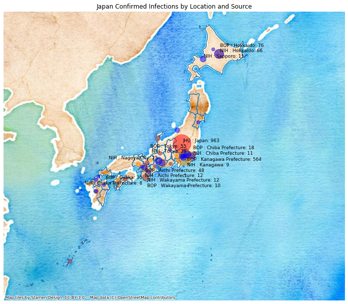

# Japan
## NSSAC COVID-19 Summary
## 02/18/2020

### Situation Report:
#### Fig 1:

#### Table 1: Situation summary

|                           | BOP              | JHU                         | NIHFogarty       | Tencent                       |
|---------------------------|------------------|-----------------------------|------------------|-------------------------------|
| First update logged       | 01/12/20         | 01/22/20                    | 01/13/20         | 02/04/20                      |
| Last update logged        | 02/06/20         | 02/17/20                    | 02/18/20         | 02/18/20                      |
| Method                    | Public line list | Cases by day & country list | Public line list | Daily cases in country scrape |
| First known case          | 01/15/20         | 01/22/20                    | 01/15/20         | 02/04/20                      |
| Total confirmed cases     | 44               | 66                          | 31               | 616                           |
| New cases since yesterday |                  |                             |                  | 97                            |
| Total suspected           |                  |                             |                  | 0                             |
| Total hospitalized        | 16               |                             | 26               |                               |
| Total recovered           | 1                | 12                          |                  | 1                             |
| Total deaths              | 0                | 1                           | 0                | 1                             |

Data sources: BOP, JHU, NIH-Fogarty, Tencent

### Geographic dispersal:
#### Fig 2:

#### Table 2: Confirmed cases by location

|    | source   | loc_name                   |   confirmed |
|----|----------|----------------------------|-------------|
|  0 | Tencent  | Japan                      |         616 |
|  1 | NIH      | Japan, Japan               |           9 |
|  2 | NIH      | Tokyo, Japan               |           5 |
|  3 | NIH      | Chiba Prefecture, Japan    |           4 |
|  4 | NIH      | Kanagawa, Japan            |           2 |
|  5 | NIH      | Kyoto, Japan               |           2 |
|  6 | NIH      | Aichi Prefecture, Japan    |           2 |
|  7 | NIH      | Nara Prefecture, Japan     |           1 |
|  8 | NIH      | Haneda, Japan              |           1 |
|  9 | NIH      | Wakayama Prefecture, Japan |           1 |
| 10 | NIH      | Hokkaido, Japan            |           1 |
| 11 | NIH      | Osaka Prefecture, Japan    |           1 |
| 12 | NIH      | Okinawa Prefecture, Japan  |           1 |
| 13 | NIH      | Mie, Japan                 |           1 |
| 14 | JHU      | Japan                      |          66 |
| 15 | BOP      | Kanagawa, Japan            |          21 |
| 16 | BOP      | Tokyo, Japan               |           8 |
| 17 | BOP      | Chiba, Japan               |           2 |
| 18 | BOP      | Kyoto, Japan               |           2 |
| 19 | BOP      | Hokkaido, Japan            |           1 |
| 20 | BOP      | Mie, Japan                 |           1 |
| 21 | BOP      | Chiba Prefecture, Japan    |           1 |
| 22 | BOP      | Kyoto Prefecture, Japan    |           1 |
| 23 | BOP      | Osaka, Japan               |           1 |
| 24 | BOP      | Nara Prefecture, Japan     |           1 |

Data sources: BOP, JHU, NIH-Fogarty, Tencent

### Observed case clusters:
#### Fig 3:

Data source: NIH-Fogarty

#### Fig 4:

Data source: BOP

### Data sources:
* **BOP:** https://github.com/beoutbreakprepared/nCoV2019
* **JHU:** https://github.com/CSSEGISandData/COVID-19/issues
* **NIH-Fogarty:** https://docs.google.com/spreadsheets/d/1jS24DjSPVWa4iuxuD4OAXrE3QeI8c9BC1hSlqr-NMiU/edit#gid=1187587451
* **Tencent:** https://news.qq.com/zt2020/page/feiyan.htm