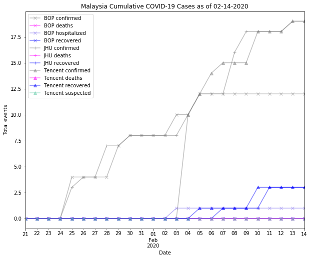
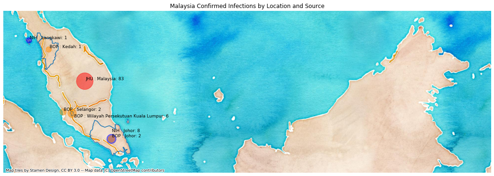
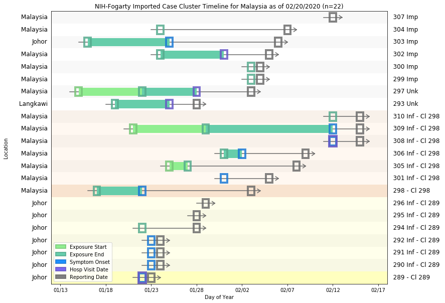
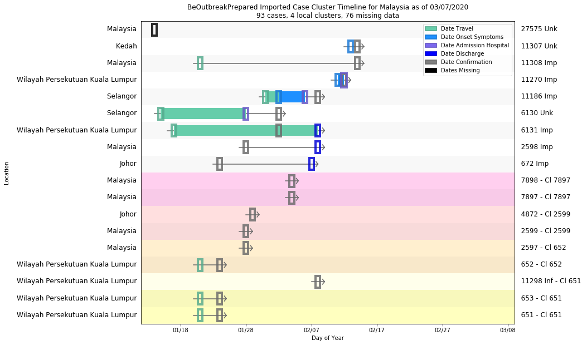
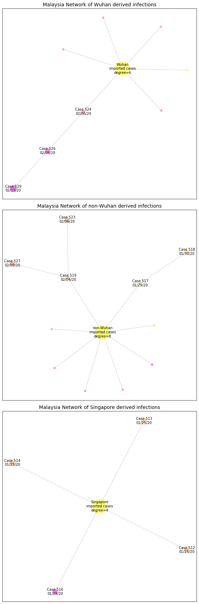

# Malaysia
## NSSAC COVID-19 Summary
## 03/06/2020

### Situation Report:
#### Fig 1:

[Merged data csv](https://github.com/SchlittDataSci/SchlittDataSci.github.io/blob/master/data/tables/Malaysia_merged_daily.csv)

#### Table 1: Situation summary

|                           | JHU                         | Tencent                       | NIHFogarty       | BOP              |
|---------------------------|-----------------------------|-------------------------------|------------------|------------------|
| First update logged       | 01/22/20                    | 02/05/20                      | 01/13/20         | 01/12/20         |
| Last update logged        | 03/05/20                    | 03/06/20                      | 03/05/20         | 03/04/20         |
| Method                    | Cases by day & country list | Daily cases in country scrape | Public line list | Public line list |
| First known case          | 01/22/20                    | 02/05/20                      | 01/24/20         | 01/25/20         |
| Total confirmed cases     | 50                          | 23                            | 23               | 17               |
| New cases since yesterday |                             | 0                             |                  |                  |
| Total suspected           |                             | 0                             |                  |                  |
| Total hospitalized        |                             |                               | 5                | 3                |
| Total recovered           | 22                          | 15                            |                  | 3                |
| Total deaths              | 0                           | 0                             | 0                | 0                |

Data sources: BOP, JHU, NIH-Fogarty, Tencent

[Sitrep csv](https://github.com/SchlittDataSci/SchlittDataSci.github.io/blob/master/data/tables/Malaysia_sitrep.csv)

### Geographic dispersal:
#### Fig 2:

#### Table 2: Confirmed cases by location

| source   | loc_name                         |   confirmed |
|----------|----------------------------------|-------------|
| NIH      | Johor                            |           8 |
| NIH      | Langkawi                         |           1 |
| JHU      | Malaysia                         |          50 |
| BOP      | Wilayah Persekutuan Kuala Lumpur |           6 |
| BOP      | Johor                            |           2 |
| BOP      | Selangor                         |           2 |
| BOP      | Kedah                            |           1 |

Data sources: BOP, JHU, Natural Earth, NIH-Fogarty, Tencent

[Case points geojson](https://github.com/SchlittDataSci/SchlittDataSci.github.io/blob/master/data/shapes/Malaysia_case_locs.geojson)

[Case admin1 locs geojson](https://github.com/SchlittDataSci/SchlittDataSci.github.io/blob/master/data/shapes/Malaysia_admin1_locs.geojson)

### Observed case clusters:
#### Fig 3:

Data source: NIH-Fogarty

#### Fig 4:

Data source: BOP

#### Fig 5:

Data source: NIH-Fogarty

### Data sources:
* **[BOP](https://github.com/beoutbreakprepared/nCoV2019)**
* **[JHU](https://github.com/CSSEGISandData/COVID-19)** 
* **[NIH-Fogarty](https://docs.google.com/spreadsheets/d/1jS24DjSPVWa4iuxuD4OAXrE3QeI8c9BC1hSlqr-NMiU/edit#gid=1187587451)** 
* **[Tencent](https://news.qq.com/zt2020/page/feiyan.htm)**
* **[Natural Earth](https://www.naturalearthdata.com/forums/forum/natural-earth-map-data/cultural-vectors/admin-1-states-provinces-and-their-boundaries/)**

<!-- Global site tag (gtag.js) - Google Analytics -->

