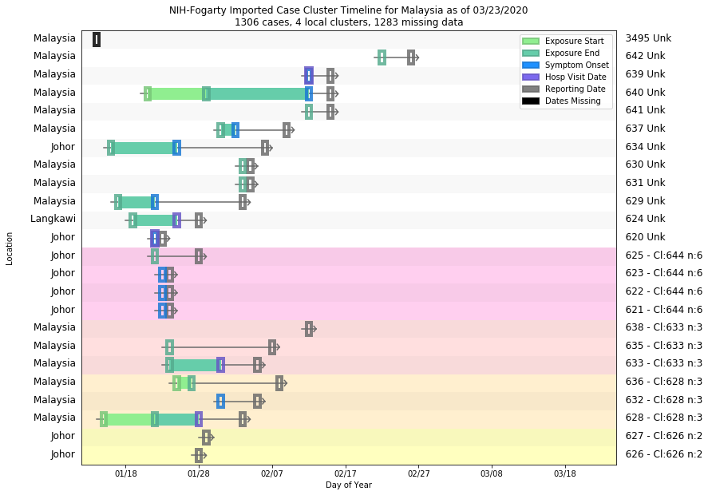
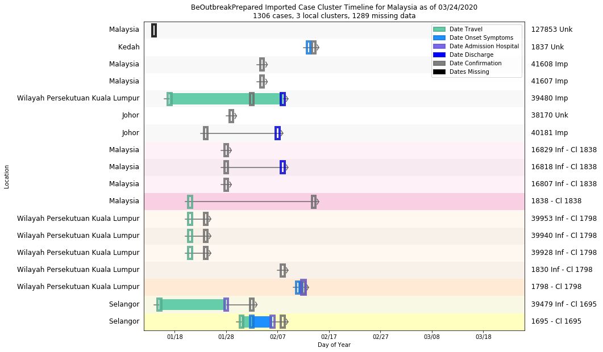

# Malaysia
## NSSAC COVID-19 Summary
## 02/19/2020

### Situation Report:
#### Fig 1:

#### Table 1: Situation summary

|                           | Tencent                       | BOP              | JHU                         | NIHFogarty       |
|---------------------------|-------------------------------|------------------|-----------------------------|------------------|
| First update logged       | 02/04/20                      | 01/12/20         | 01/22/20                    | 01/13/20         |
| Last update logged        | 02/19/20                      | 02/06/20         | 02/18/20                    | 02/18/20         |
| Method                    | Daily cases in country scrape | Public line list | Cases by day & country list | Public line list |
| First known case          | 02/06/20                      | 01/25/20         | 01/22/20                    | 01/24/20         |
| Total confirmed cases     | 21                            | 12               | 22                          | 18               |
| New cases since yesterday | 2                             |                  |                             |                  |
| Total suspected           | 0                             |                  |                             |                  |
| Total hospitalized        |                               | 1                |                             | 4                |
| Total recovered           | 3                             | 0                | 13                          |                  |
| Total deaths              | 0                             | 0                | 0                           | 0                |

Data sources: BOP, JHU, NIH-Fogarty, Tencent

### Geographic dispersal:
#### Fig 2:

#### Table 2: Confirmed cases by location

| source   | loc_name           |   confirmed |
|----------|--------------------|-------------|
| Tencent  | Malaysia           |          22 |
| NIH      | Malaysia, Malaysia |           9 |
| NIH      | Johor, Malaysia    |           8 |
| NIH      | Langkawi, Malaysia |           1 |
| JHU      | Malaysia           |          22 |
| BOP      | Johor, Malaysia    |           1 |

Data sources: BOP, JHU, NIH-Fogarty, Tencent

### Observed case clusters:
#### Fig 3:

Data source: NIH-Fogarty

#### Fig 4:

Data source: BOP

### Data sources:
* **BOP:** https://github.com/beoutbreakprepared/nCoV2019
* **JHU:** https://github.com/CSSEGISandData/COVID-19/
* **NIH-Fogarty:** https://docs.google.com/spreadsheets/d/1jS24DjSPVWa4iuxuD4OAXrE3QeI8c9BC1hSlqr-NMiU/edit#gid=1187587451
* **Tencent:** https://news.qq.com/zt2020/page/feiyan.htm