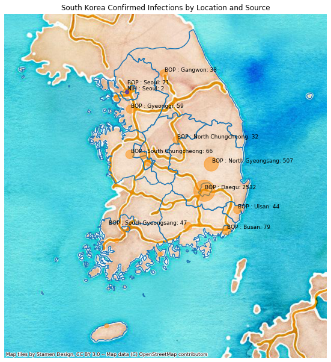

# South Korea
## NSSAC COVID-19 Summary
## 02/15/2020

 ### Situation Report:
#### Fig 1:

#### Table 1: Situation summary
|                           | BOP              | JHU                         | Tencent                       |
|---------------------------|------------------|-----------------------------|-------------------------------|
| First update logged       | 01/12/20         | 01/22/20                    | 02/04/20                      |
| Last update logged        | 02/06/20         | 02/14/20                    | 02/15/20                      |
| Method                    | Public line list | Cases by day & country list | Daily cases in country scrape |
| First known case          | 01/20/20         | 01/22/20                    | 02/07/20                      |
| Total confirmed cases     | 21               | 28                          | 28                            |
| New cases since yesterday |                  |                             | 0                             |
| Total suspected           |                  |                             | 0                             |
| Total hospitalized        | 5                |                             |                               |
| Total recovered           | 0                | 7                           | 3                             |
| Total deaths              | 0                | 0                           | 0                             |
Data sources: BOP, JHU, Tencent

### Geographic dispersal:
#### Fig 2:

#### Table 2: Confirmed cases by location
|    | source   | loc_name              |   confirmed |
|----|----------|-----------------------|-------------|
|  2 | Tencent  | Korea                 |          28 |
|  0 | JHU      | South Korea           |          28 |
|  1 | BOP      | Gyeonggi, South Korea |           1 |

Data sources: BOP, JHU, Tencent

### Observed case clusters:
#### Fig 3:

Data source: BOP

### Data sources:
* **BOP:** https://github.com/beoutbreakprepared/nCoV2019
* **JHU:** https://github.com/CSSEGISandData/COVID-19/issues
* **Tencent:** https://news.qq.com/zt2020/page/feiyan.htm