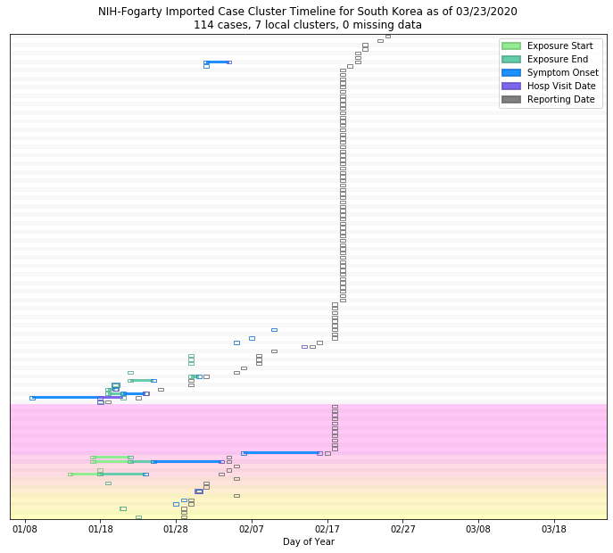

# South Korea
## NSSAC COVID-19 Summary
## 03/01/2020

### Situation Report:
#### Fig 1:

[Merged data csv](https://github.com/SchlittDataSci/SchlittDataSci.github.io/blob/master/data/tables/South_Korea_merged_daily.csv)

#### Table 1: Situation summary

|                           | Tencent                       | BOP              | JHU                         | NIHFogarty       |
|---------------------------|-------------------------------|------------------|-----------------------------|------------------|
| First update logged       | 02/04/20                      | 01/12/20         | 01/22/20                    | 01/13/20         |
| Last update logged        | 03/01/20                      | 02/29/20         | 02/29/20                    | 02/28/20         |
| Method                    | Daily cases in country scrape | Public line list | Cases by day & country list | Public line list |
| First known case          | 02/04/20                      | 01/20/20         | 01/22/20                    | 01/20/20         |
| Total confirmed cases     | 3150                          | 3150             | 3150                        | 3150             |
| New cases since yesterday | 0                             |                  |                             |                  |
| Total suspected           | 0                             |                  |                             |                  |
| Total hospitalized        |                               | 24               |                             | 9                |
| Total recovered           | 24                            | 0                | 27                          |                  |
| Total deaths              | 13                            | 0                | 16                          | 0                |

Data sources: BOP, JHU, NIH-Fogarty, Tencent

[Sitrep csv](https://github.com/SchlittDataSci/SchlittDataSci.github.io/blob/master/data/tables/South_Korea_sitrep.csv)

### Geographic dispersal:
#### Fig 2:

#### Table 2: Confirmed cases by location

| source   | loc_name                       |   confirmed |
|----------|--------------------------------|-------------|
| NIH      | Seoul, South Korea             |           2 |
| JHU      | South Korea                    |        3150 |
| BOP      | Daegu, South Korea             |         552 |
| BOP      | North Gyeongsang, South Korea  |         250 |
| BOP      | Busan, South Korea             |          40 |
| BOP      | Seoul, South Korea             |          33 |
| BOP      | Gyeonggi, South Korea          |          16 |
| BOP      | South Gyeongsang, South Korea  |          10 |
| BOP      | Gangwon, South Korea           |           5 |
| BOP      | South Chungcheong, South Korea |           4 |
| BOP      | Gwangju, South Korea           |           4 |
| BOP      | Daejeon, South Korea           |           4 |
| BOP      | North Chungcheong, South Korea |           3 |
| BOP      | Incheon, South Korea           |           2 |
| BOP      | Ulsan, South Korea             |           2 |
| BOP      | Jeju, South Korea              |           2 |
| BOP      | Sejong, South Korea            |           1 |
| BOP      | South Jeolla, South Korea      |           1 |
| BOP      | North Jeolla, South Korea      |           1 |

Data sources: BOP, JHU, Natural Earth, NIH-Fogarty, Tencent

[Case points geojson](https://github.com/SchlittDataSci/SchlittDataSci.github.io/blob/master/data/shapes/South_Korea_case_locs.geojson)

[Case admin1 locs geojson](https://github.com/SchlittDataSci/SchlittDataSci.github.io/blob/master/data/shapes/South_Korea_admin1_locs.geojson)

### Observed case clusters:
#### Fig 3:

Data source: NIH-Fogarty

#### Fig 4:

Data source: BOP

### Data sources:
* **[BOP](https://github.com/beoutbreakprepared/nCoV2019)**
* **[JHU](https://github.com/CSSEGISandData/COVID-19)** 
* **[NIH-Fogarty](https://docs.google.com/spreadsheets/d/1jS24DjSPVWa4iuxuD4OAXrE3QeI8c9BC1hSlqr-NMiU/edit#gid=1187587451)** 
* **[Tencent](https://news.qq.com/zt2020/page/feiyan.htm)**
* **[Natural Earth](https://www.naturalearthdata.com/forums/forum/natural-earth-map-data/cultural-vectors/admin-1-states-provinces-and-their-boundaries/)**

<!-- Global site tag (gtag.js) - Google Analytics -->

