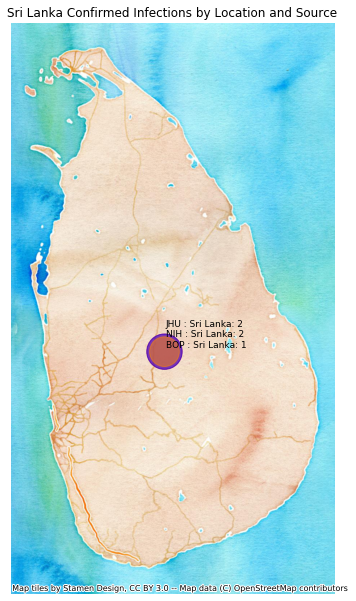

# Sri Lanka
## NSSAC COVID-19 Summary
## 02/16/2020

### Situation Report:
#### Fig 1:

#### Table 1: Situation summary

|                           | BOP              | JHU                         | Tencent                       |
|---------------------------|------------------|-----------------------------|-------------------------------|
| First update logged       | 01/12/20         | 01/22/20                    | 02/04/20                      |
| Last update logged        | 02/06/20         | 02/15/20                    | 02/16/20                      |
| Method                    | Public line list | Cases by day & country list | Daily cases in country scrape |
| First known case          | 01/27/20         | 01/22/20                    | 02/06/20                      |
| Total confirmed cases     | 1                | 1                           | 0                             |
| New cases since yesterday |                  |                             | -1                            |
| Total suspected           |                  |                             | 0                             |
| Total hospitalized        | 1                |                             |                               |
| Total recovered           | 0                | 1                           | 0                             |
| Total deaths              | 0                | 0                           | 0                             |
Data sources: BOP, JHU, Tencent

### Geographic dispersal:
#### Fig 2:

#### Table 2: Confirmed cases by location

|    | source   | loc_name   |   confirmed |
|----|----------|------------|-------------|
|  2 | Tencent  | Sri Lanka  |           1 |
|  0 | JHU      | Sri Lanka  |           1 |
|  1 | BOP      | Sri Lanka  |           1 |

Data sources: BOP, JHU, Tencent

### Observed case clusters:
#### Fig 3:

Data source: BOP

### Data sources:
* **BOP:** https://github.com/beoutbreakprepared/nCoV2019
* **JHU:** https://github.com/CSSEGISandData/COVID-19/issues
* **Tencent:** https://news.qq.com/zt2020/page/feiyan.htm