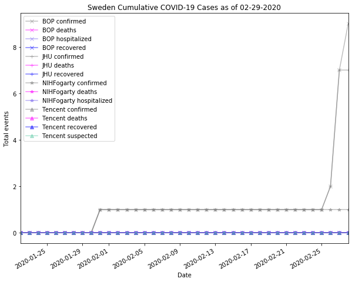
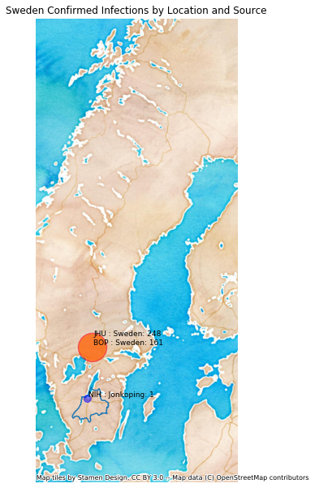
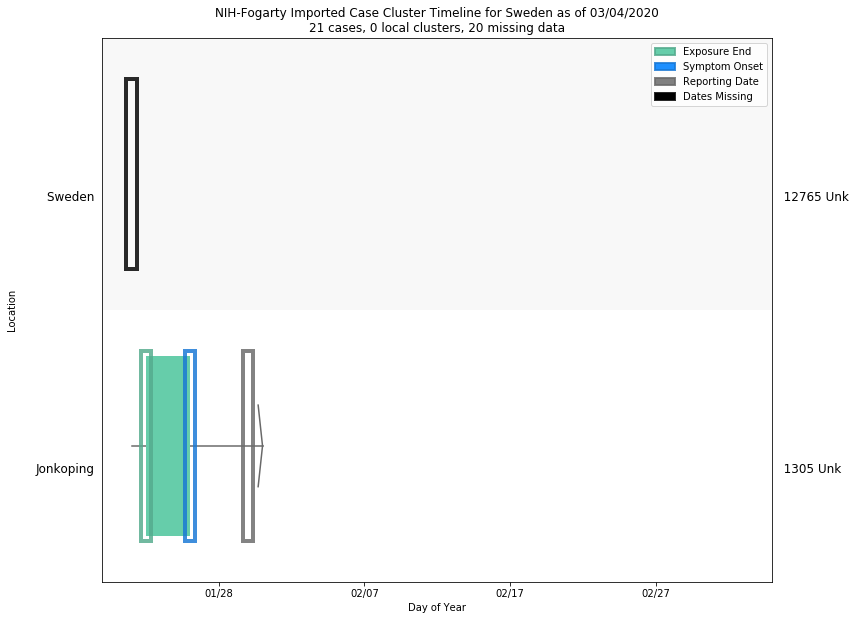
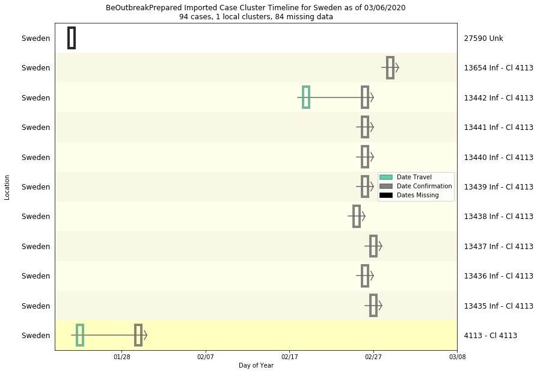
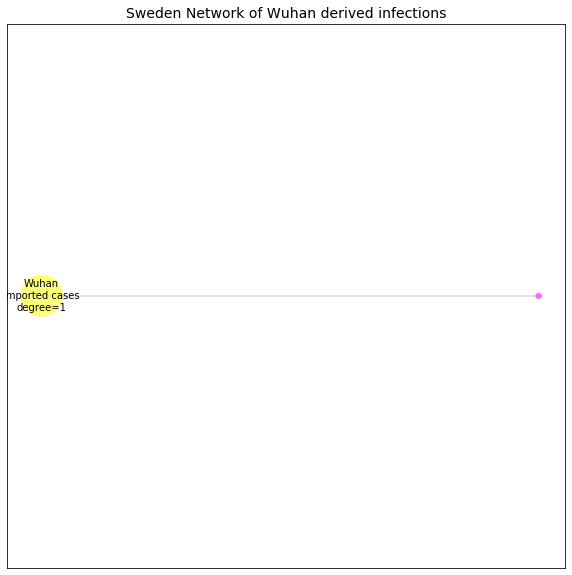

# Sweden
## NSSAC COVID-19 Summary
## 02/27/2020

### Situation Report:
#### Fig 1:

[Merged data csv](https://github.com/SchlittDataSci/SchlittDataSci.github.io/blob/master/data/tables/Sweden_merged_daily.csv)

#### Table 1: Situation summary

|                           | JHU                         | NIHFogarty       | BOP              |
|---------------------------|-----------------------------|------------------|------------------|
| First update logged       | 01/22/20                    | 01/13/20         | 01/12/20         |
| Last update logged        | 02/26/20                    | 02/27/20         | 02/26/20         |
| Method                    | Cases by day & country list | Public line list | Public line list |
| First known case          | 01/22/20                    | 01/31/20         | 01/31/20         |
| Total confirmed cases     | 2                           | 1                | 1                |
| New cases since yesterday | 1                           |                  |                  |
| Total suspected           |                             |                  |                  |
| Total hospitalized        |                             | 0                | 0                |
| Total recovered           | 0                           |                  | 0                |
| Total deaths              | 0                           | 0                | 0                |

Data sources: BOP, JHU, NIH-Fogarty, 

[Sitrep csv](https://github.com/SchlittDataSci/SchlittDataSci.github.io/blob/master/data/tables/Sweden_sitrep.csv)

### Geographic dispersal:
#### Fig 2:

#### Table 2: Confirmed cases by location

| source   | loc_name          |   confirmed |
|----------|-------------------|-------------|
| NIH      | Jonkoping, Sweden |           1 |
| JHU      | Sweden            |           2 |
| BOP      | Sweden            |           1 |

Data sources: BOP, JHU, Natural Earth, NIH-Fogarty, Tencent

[Case points geojson](https://github.com/SchlittDataSci/SchlittDataSci.github.io/blob/master/data/shapes/Sweden_case_locs.geojson)

[Case admin1 locs geojson](https://github.com/SchlittDataSci/SchlittDataSci.github.io/blob/master/data/shapes/Sweden_admin1_locs.geojson)

### Observed case clusters:
#### Fig 3:

Data source: NIH-Fogarty

#### Fig 4:

Data source: BOP

#### Fig 5:

Data source: NIH-Fogarty

### Data sources:
* **[BOP](https://github.com/beoutbreakprepared/nCoV2019)**
* **[JHU](https://github.com/CSSEGISandData/COVID-19)** 
* **[NIH-Fogarty](https://docs.google.com/spreadsheets/d/1jS24DjSPVWa4iuxuD4OAXrE3QeI8c9BC1hSlqr-NMiU/edit#gid=1187587451)** 
* **[Tencent](https://news.qq.com/zt2020/page/feiyan.htm)**
* **[Natural Earth](https://www.naturalearthdata.com/forums/forum/natural-earth-map-data/cultural-vectors/admin-1-states-provinces-and-their-boundaries/)**

<!-- Global site tag (gtag.js) - Google Analytics -->

