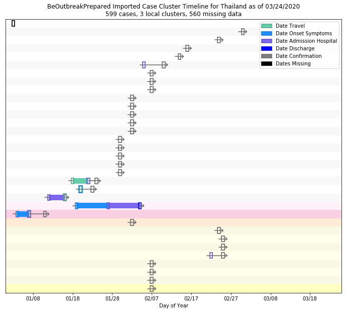

# Thailand
## NSSAC COVID-19 Summary
## 02/20/2020

### Situation Report:
#### Fig 1:

#### Table 1: Situation summary

|                           | NIHFogarty       | Tencent                       | JHU                         | BOP              |
|---------------------------|------------------|-------------------------------|-----------------------------|------------------|
| First update logged       | 01/13/20         | 02/04/20                      | 01/22/20                    | 01/12/20         |
| Last update logged        | 02/20/20         | 02/20/20                      | 02/19/20                    | 02/06/20         |
| Method                    | Public line list | Daily cases in country scrape | Cases by day & country list | Public line list |
| First known case          | 01/13/20         | 02/04/20                      | 01/22/20                    | 01/12/20         |
| Total confirmed cases     | 35               | 35                            | 35                          | 25               |
| New cases since yesterday |                  | 0                             |                             |                  |
| Total suspected           |                  | 0                             |                             |                  |
| Total hospitalized        | 7                |                               |                             | 3                |
| Total recovered           |                  | 15                            | 15                          | 0                |
| Total deaths              | 0                | 0                             | 0                           | 0                |

Data sources: BOP, JHU, NIH-Fogarty, Tencent

### Geographic dispersal:
#### Fig 2:

#### Table 2: Confirmed cases by location

| source   | loc_name                |   confirmed |
|----------|-------------------------|-------------|
| Tencent  | Thailand                |          35 |
| NIH      | Thailand, Thailand      |          35 |
| JHU      | Thailand                |          35 |
| BOP      | Nonthaburi, Thailand    |           1 |
| BOP      | Nakhon Pathom, Thailand |           1 |

Data sources: BOP, JHU, NIH-Fogarty, Tencent

### Observed case clusters:
#### Fig 3:

Data source: NIH-Fogarty

#### Fig 4:

Data source: BOP

### Data sources:
* **BOP:** https://github.com/beoutbreakprepared/nCoV2019
* **JHU:** https://github.com/CSSEGISandData/COVID-19/
* **NIH-Fogarty:** https://docs.google.com/spreadsheets/d/1jS24DjSPVWa4iuxuD4OAXrE3QeI8c9BC1hSlqr-NMiU/edit#gid=1187587451
* **Tencent:** https://news.qq.com/zt2020/page/feiyan.htm

<!-- Global site tag (gtag.js) - Google Analytics -->

