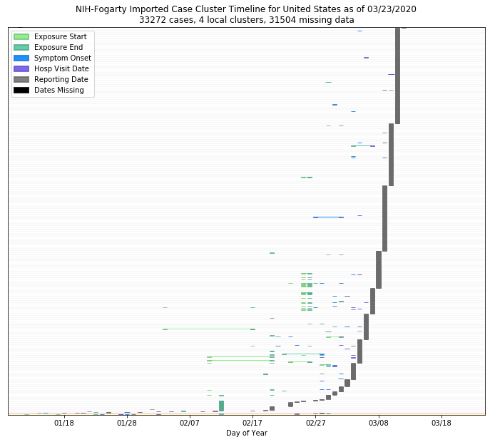

# United States
## NSSAC COVID-19 Summary
## 03/13/2020

### Situation Report:
#### Fig 1:

[Merged data csv](https://github.com/SchlittDataSci/SchlittDataSci.github.io/blob/master/data/tables/United_States_merged_daily.csv)

#### Table 1: Situation summary

|                           | JHU                         | NIHFogarty       | BOP              | Tencent                       |
|---------------------------|-----------------------------|------------------|------------------|-------------------------------|
| First update logged       | 01/22/20                    | 01/13/20         | 01/12/20         | 02/04/20                      |
| Last update logged        | 03/11/20                    | 03/11/20         | 03/09/20         | 03/12/20                      |
| Method                    | Cases by day & country list | Public line list | Public line list | Daily cases in country scrape |
| First known case          | 01/22/20                    | 01/21/20         | 01/20/20         | 02/04/20                      |
| Total confirmed cases     | 1281                        | 1097             | 572              | 60                            |
| New cases since yesterday |                             |                  |                  | 0                             |
| Total suspected           |                             |                  |                  | 0                             |
| Total hospitalized        |                             | 25               | 9                |                               |
| Total recovered           | 8                           |                  | 0                | 3                             |
| Total deaths              | 36                          | 0                | 2                | 0                             |

Data sources: BOP, JHU, NIH-Fogarty, Tencent

[Sitrep csv](https://github.com/SchlittDataSci/SchlittDataSci.github.io/blob/master/data/tables/United_States_sitrep.csv)

### Geographic dispersal:
#### Fig 2:

#### Table 2: Confirmed cases by location

| source   | loc_name             |   confirmed |
|----------|----------------------|-------------|
| NIH      | Washington           |         288 |
| NIH      | New York             |         188 |
| NIH      | California           |         160 |
| NIH      | Massachusetts        |          90 |
| NIH      | New Jersey           |          25 |
| NIH      | Texas                |          24 |
| NIH      | Florida              |          23 |
| NIH      | Georgia              |          22 |
| NIH      | Colorado             |          17 |
| NIH      | Illinois             |          17 |
| NIH      | Oregon               |          15 |
| NIH      | Pennsylvania         |          15 |
| NIH      | Iowa                 |          13 |
| NIH      | Indiana              |          10 |
| NIH      | Arizona              |           9 |
| NIH      | Maryland             |           9 |
| NIH      | South Carolina       |           8 |
| NIH      | Virginia             |           8 |
| NIH      | Kentucky             |           8 |
| NIH      | Tennessee            |           7 |
| NIH      | North Carolina       |           7 |
| NIH      | Louisiana            |           6 |
| NIH      | New Hampshire        |           5 |
| NIH      | Nebraska             |           5 |
| NIH      | district of columbia |           5 |
| NIH      | South Dakota         |           5 |
| NIH      | Rhode Island         |           5 |
| NIH      | Nevada               |           5 |
| NIH      | Minnesota            |           4 |
| NIH      | New Mexico           |           3 |
| NIH      | Wisconsin            |           3 |
| NIH      | Ohio                 |           3 |
| NIH      | Utah                 |           2 |
| NIH      | Oklahoma             |           2 |
| NIH      | Hawaii               |           2 |
| NIH      | Michigan             |           2 |
| NIH      | Connecticut          |           2 |
| NIH      | Kansas               |           1 |
| NIH      | USA                  |           1 |
| NIH      | Missouri             |           1 |
| NIH      | Vermont              |           1 |
| NIH      | New jersey           |           1 |
| NIH      | Arkansas             |           1 |
| JHU      | Washington           |         366 |
| JHU      | New York             |         220 |
| JHU      | California           |         177 |
| JHU      | Massachusetts        |          95 |
| JHU      | Diamond Princess     |          46 |
| JHU      | Colorado             |          34 |
| JHU      | Florida              |          28 |
| JHU      | Illinois             |          25 |
| JHU      | New Jersey           |          23 |
| JHU      | Georgia              |          23 |
| JHU      | Grand Princess       |          21 |
| JHU      | Texas                |          21 |
| JHU      | Oregon               |          19 |
| JHU      | Pennsylvania         |          16 |
| JHU      | Iowa                 |          13 |
| JHU      | Indiana              |          11 |
| JHU      | District of Columbia |          10 |
| JHU      | South Carolina       |          10 |
| JHU      | Arizona              |           9 |
| JHU      | Tennessee            |           9 |
| JHU      | Maryland             |           9 |
| JHU      | Kentucky             |           8 |
| JHU      | South Dakota         |           8 |
| JHU      | North Carolina       |           7 |
| JHU      | Nevada               |           7 |
| JHU      | Louisiana            |           6 |
| JHU      | Wisconsin            |           6 |
| JHU      | Rhode Island         |           5 |
| JHU      | Minnesota            |           5 |
| JHU      | Nebraska             |           5 |
| JHU      | New Hampshire        |           5 |
| JHU      | Ohio                 |           4 |
| JHU      | Utah                 |           3 |
| JHU      | Connecticut          |           3 |
| JHU      | New Mexico           |           3 |
| JHU      | Hawaii               |           2 |
| JHU      | Oklahoma             |           2 |
| JHU      | Michigan             |           2 |
| JHU      | Kansas               |           1 |
| JHU      | Missouri             |           1 |
| JHU      | Vermont              |           1 |
| JHU      | Arkansas             |           1 |
| JHU      | Delaware             |           1 |
| JHU      | Montana              |           1 |
| JHU      | Ulster County        |           0 |
| JHU      | Kittitas County      |           0 |
| JHU      | Harford County       |           0 |
| JHU      | Hendricks County     |           0 |
| JHU      | Hudson County        |           0 |
| JHU      | Johnson County       |           0 |
| JHU      | Marion County        |           0 |
| JHU      | Manatee County       |           0 |
| JHU      | Douglas County       |           0 |
| JHU      | Okaloosa County      |           0 |
| JHU      | Polk County          |           0 |
| JHU      | Fresno County        |           0 |
| JHU      | Johnson County       |           0 |
| JHU      | Davidson County      |           0 |
| JHU      | Berkshire County     |           0 |
| JHU      | Shelby County        |           0 |
| JHU      | Harrison County      |           0 |
| JHU      | Spartanburg County   |           0 |
| JHU      | Shasta County        |           0 |
| JHU      | Jefferson Parish     |           0 |
| JHU      | Jefferson County     |           0 |
| JHU      | Collin County        |           0 |
| JHU      | Cherokee County      |           0 |
| JHU      | Riverside County     |           0 |
| JHU      | Wayne                |           0 |
| JHU      | St. Louis County     |           0 |
| JHU      | Orleans              |           0 |
| JHU      | Howard               |           0 |
| JHU      | St. Joseph           |           0 |
| JHU      | Knox                 |           0 |
| JHU      | Stark                |           0 |
| JHU      | Anoka                |           0 |
| JHU      | Olmsted              |           0 |
| JHU      | Summit               |           0 |
| JHU      | Fairfield            |           0 |
| JHU      | Litchfield           |           0 |
| JHU      | Pennington           |           0 |
| JHU      | New Castle           |           0 |
| JHU      | Beadle               |           0 |
| JHU      | Charles Mix          |           0 |
| JHU      | Davison              |           0 |
| JHU      | Minnehaha            |           0 |
| JHU      | Bon Homme            |           0 |
| JHU      | Socorro              |           0 |
| JHU      | Bernalillo           |           0 |
| JHU      | Oakland              |           0 |
| JHU      | Carver County        |           0 |
| JHU      | Charlotte County     |           0 |
| JHU      | Cuyahoga             |           0 |
| JHU      | Bennington County    |           0 |
| JHU      | Napa                 |           0 |
| JHU      | Burlington           |           0 |
| JHU      | Monmouth             |           0 |
| JHU      | Gregg                |           0 |
| JHU      | Fayette              |           0 |
| JHU      | Floyd                |           0 |
| JHU      | DeKalb               |           0 |
| JHU      | Gwinnett             |           0 |
| JHU      | Worcester            |           0 |
| JHU      | Ventura              |           0 |
| JHU      | Santa Cruz           |           0 |
| JHU      | Passaic              |           0 |
| JHU      | Solano               |           0 |
| JHU      | Kitsap               |           0 |
| JHU      | Wyoming              |           0 |
| JHU      | West Virginia        |           0 |
| JHU      | North Dakota         |           0 |
| JHU      | Mississippi          |           0 |
| JHU      | Maine                |           0 |
| JHU      | Idaho                |           0 |
| JHU      | Alaska               |           0 |
| JHU      | Camden               |           0 |
| JHU      | Union                |           0 |
| JHU      | Weber                |           0 |
| JHU      | Prince George's      |           0 |
| JHU      | Volusia County       |           0 |
| JHU      | Pierce               |           0 |
| JHU      | Dane                 |           0 |
| JHU      | Boone                |           0 |
| JHU      | Adams                |           0 |
| JHU      | Noble                |           0 |
| JHU      | Pima                 |           0 |
| JHU      | Camden               |           0 |
| JHU      | Pottawattamie        |           0 |
| JHU      | Loudoun              |           0 |
| JHU      | Eagle                |           0 |
| JHU      | Spotsylvania         |           0 |
| JHU      | Arlington            |           0 |
| JHU      | Norfolk              |           0 |
| JHU      | Philadelphia         |           0 |
| JHU      | Monroe               |           0 |
| JHU      | Kane                 |           0 |
| JHU      | Gunnison             |           0 |
| JHU      | Arapahoe             |           0 |
| JHU      | Larimer              |           0 |
| JHU      | Johnson              |           0 |
| JHU      | Sullivan             |           0 |
| JHU      | Lancaster            |           0 |
| JHU      | Yolo County          |           0 |
| JHU      | Chatham County       |           0 |
| JHU      | Delaware County      |           0 |
| JHU      | Douglas County       |           0 |
| JHU      | Fayette County       |           0 |
| JHU      | Marion County        |           0 |
| JHU      | Middlesex County     |           0 |
| JHU      | Nassau County        |           0 |
| JHU      | Ramsey County        |           0 |
| JHU      | Washoe County        |           0 |
| JHU      | Wayne County         |           0 |
| JHU      | Santa Clara County   |           0 |
| JHU      | Harris County        |           0 |
| JHU      | Clark County         |           0 |
| JHU      | Fort Bend County     |           0 |
| JHU      | Grant County         |           0 |
| JHU      | Santa Rosa County    |           0 |
| JHU      | Suffolk County       |           0 |
| JHU      | New York County      |           0 |
| JHU      | Montgomery County    |           0 |
| JHU      | Suffolk County       |           0 |
| JHU      | Denver County        |           0 |
| JHU      | Summit County        |           0 |
| JHU      | Providence County    |           0 |
| JHU      | Douglas County       |           0 |
| JHU      | Tulsa County         |           0 |
| JHU      | Pierce County        |           0 |
| JHU      | Fairfax County       |           0 |
| JHU      | Rockingham County    |           0 |
| JHU      | Washington           |           0 |
| JHU      | Montgomery County    |           0 |
| JHU      | Alameda County       |           0 |
| JHU      | Broward County       |           0 |
| JHU      | Lee County           |           0 |
| JHU      | Pinal County         |           0 |
| JHU      | Rockland County      |           0 |
| JHU      | Saratoga County      |           0 |
| JHU      | Charleston County    |           0 |
| JHU      | Clark County         |           0 |
| JHU      | Cobb County          |           0 |
| JHU      | Davis County         |           0 |
| JHU      | El Paso County       |           0 |
| JHU      | Honolulu County      |           0 |
| JHU      | Jackson County       |           0 |
| JHU      | Jefferson County     |           0 |
| JHU      | Kershaw County       |           0 |
| JHU      | Klamath County       |           0 |
| JHU      | Madera County        |           0 |
| JHU      | Bergen County        |           0 |
| JHU      | San Francisco County |           0 |
| JHU      | Hanover              |           0 |
| JHU      | Pasco                |           0 |
| JHU      | Marin                |           0 |
| JHU      | Calaveras            |           0 |
| JHU      | Stanislaus           |           0 |
| JHU      | San Joaquin          |           0 |
| JHU      | Essex                |           0 |
| JHU      | Charlton             |           0 |
| JHU      | Collier              |           0 |
| JHU      | Pinellas             |           0 |
| JHU      | Alachua              |           0 |
| JHU      | Nassau               |           0 |
| JHU      | Dallas               |           0 |
| JHU      | Contra Costa County  |           0 |
| JHU      | Tarrant              |           0 |
| JHU      | Montgomery           |           0 |
| JHU      | Middlesex            |           0 |
| JHU      | Jefferson            |           0 |
| JHU      | Multnomah            |           0 |
| JHU      | Polk                 |           0 |
| JHU      | Deschutes            |           0 |
| JHU      | McHenry              |           0 |
| JHU      | Lake                 |           0 |
| JHU      | Bucks                |           0 |
| JHU      | Whatcom              |           0 |
| JHU      | Island               |           0 |
| JHU      | Thurston             |           0 |
| JHU      | Skagit               |           0 |
| JHU      | Orange County        |           0 |
| JHU      | Norfolk County       |           0 |
| JHU      | Maricopa County      |           0 |
| JHU      | Wake County          |           0 |
| JHU      | Westchester County   |           0 |
| JHU      | Grafton County       |           0 |
| JHU      | Hillsborough         |           0 |
| JHU      | Placer County        |           0 |
| JHU      | San Mateo            |           0 |
| JHU      | Sonoma County        |           0 |
| JHU      | Umatilla             |           0 |
| JHU      | Fulton County        |           0 |
| JHU      | Washington County    |           0 |
| JHU      | Snohomish County     |           0 |
| JHU      | Humboldt County      |           0 |
| JHU      | Sacramento County    |           0 |
| JHU      | San Diego County     |           0 |
| JHU      | San Benito           |           0 |
| JHU      | Los Angeles          |           0 |
| JHU      | King County          |           0 |
| JHU      | Cook County          |           0 |
| JHU      | Williamson County    |           0 |
| BOP      | New York             |         142 |
| BOP      | Washington           |         136 |
| BOP      | California           |         110 |
| BOP      | Massachusetts        |          28 |
| BOP      | Texas                |          14 |
| BOP      | Oregon               |          14 |
| BOP      | Florida              |          13 |
| BOP      | Georgia              |          12 |
| BOP      | New Jersey           |          11 |
| BOP      | Arizona              |           9 |
| BOP      | Colorado             |           9 |
| BOP      | Pennsylvania         |           7 |
| BOP      | Illinois             |           7 |
| BOP      | South Carolina       |           6 |
| BOP      | Maryland             |           5 |
| BOP      | Tennessee            |           5 |
| BOP      | Nevada               |           4 |
| BOP      | Indiana              |           4 |
| BOP      | New Hampshire        |           4 |
| BOP      | Kentucky             |           4 |
| BOP      | Nebraska             |           3 |
| BOP      | Rhode Island         |           3 |
| BOP      | Virginia             |           3 |
| BOP      | Hawaii               |           3 |
| BOP      | Iowa                 |           3 |
| BOP      | Minnesota            |           2 |
| BOP      | North Carolina       |           2 |
| BOP      | Utah                 |           1 |
| BOP      | Wisconsin            |           1 |
| BOP      | Louisiana            |           1 |
| BOP      | District of Columbia |           1 |
| BOP      | Connecticut          |           1 |
| BOP      | Oklahoma             |           1 |
| BOP      | Kansas               |           1 |
| BOP      | Vermont              |           1 |
| BOP      | Missouri             |           1 |

Data sources: BOP, JHU, Natural Earth, NIH-Fogarty, Tencent

[Case points geojson](https://github.com/SchlittDataSci/SchlittDataSci.github.io/blob/master/data/shapes/United_States_case_locs.geojson)

[Case admin1 locs geojson](https://github.com/SchlittDataSci/SchlittDataSci.github.io/blob/master/data/shapes/United_States_admin1_locs.geojson)

### Observed case clusters:
#### Fig 3:

Data source: NIH-Fogarty

#### Fig 4:

Data source: BOP

#### Fig 5:

Data source: NIH-Fogarty

### Data sources:
* **[BOP](https://github.com/beoutbreakprepared/nCoV2019)**
* **[JHU](https://github.com/CSSEGISandData/COVID-19)** 
* **[NIH-Fogarty](https://docs.google.com/spreadsheets/d/1jS24DjSPVWa4iuxuD4OAXrE3QeI8c9BC1hSlqr-NMiU/edit#gid=1187587451)** 
* **[Tencent](https://news.qq.com/zt2020/page/feiyan.htm)**
* **[Natural Earth](https://www.naturalearthdata.com/forums/forum/natural-earth-map-data/cultural-vectors/admin-1-states-provinces-and-their-boundaries/)**

<!-- Global site tag (gtag.js) - Google Analytics -->

