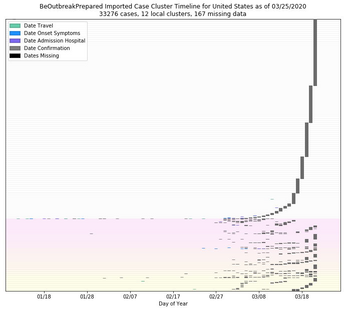

# United States
## NSSAC COVID-19 Summary
## 02/18/2020

### Situation Report:
#### Fig 1:

#### Table 1: Situation summary

|                           | BOP              | JHU                         | Tencent                       |
|---------------------------|------------------|-----------------------------|-------------------------------|
| First update logged       | 01/12/20         | 01/22/20                    | 02/04/20                      |
| Last update logged        | 02/06/20         | 02/17/20                    | 02/18/20                      |
| Method                    | Public line list | Cases by day & country list | Daily cases in country scrape |
| First known case          | 01/20/20         | 01/22/20                    | 02/06/20                      |
| Total confirmed cases     | 12               | 15                          | 15                            |
| New cases since yesterday |                  |                             | 15                            |
| Total suspected           |                  |                             | 0                             |
| Total hospitalized        | 2                |                             |                               |
| Total recovered           | 0                | 3                           | 3                             |
| Total deaths              | 0                | 0                           | 0                             |

Data sources: BOP, JHU, Tencent

### Geographic dispersal:
#### Fig 2:

#### Table 2: Confirmed cases by location

|    | source   | loc_name                        |   confirmed |
|----|----------|---------------------------------|-------------|
|  0 | Tencent  | United States                   |          15 |
|  1 | JHU      | San Benito, CA, US              |           2 |
|  2 | JHU      | Chicago, IL, US                 |           2 |
|  3 | JHU      | San Diego County, CA, US        |           2 |
|  4 | JHU      | Santa Clara, CA, US             |           2 |
|  5 | JHU      | Boston, MA, US                  |           1 |
|  6 | JHU      | Madison, WI, US                 |           1 |
|  7 | JHU      | Los Angeles, CA, US             |           1 |
|  8 | JHU      | San Antonio, TX, US             |           1 |
|  9 | JHU      | Orange, CA, US                  |           1 |
| 10 | JHU      | Tempe, AZ, US                   |           1 |
| 11 | JHU      | Seattle, WA, US                 |           1 |
| 12 | BOP      | California, United States       |           6 |
| 13 | BOP      | Illinois, United States         |           2 |
| 14 | BOP      | Wisconsin, United States        |           1 |
| 15 | BOP      | Washington State, United States |           1 |
| 16 | BOP      | Arizona, United States          |           1 |
| 17 | BOP      | Massachusetts, United States    |           1 |

Data sources: BOP, JHU, Tencent

### Observed case clusters:
#### Fig 3:

Data source: BOP

### Data sources:
* **BOP:** https://github.com/beoutbreakprepared/nCoV2019
* **JHU:** https://github.com/CSSEGISandData/COVID-19/issues
* **NIH-Fogarty:** https://docs.google.com/spreadsheets/d/1jS24DjSPVWa4iuxuD4OAXrE3QeI8c9BC1hSlqr-NMiU/edit#gid=1187587451
* **Tencent:** https://news.qq.com/zt2020/page/feiyan.htm