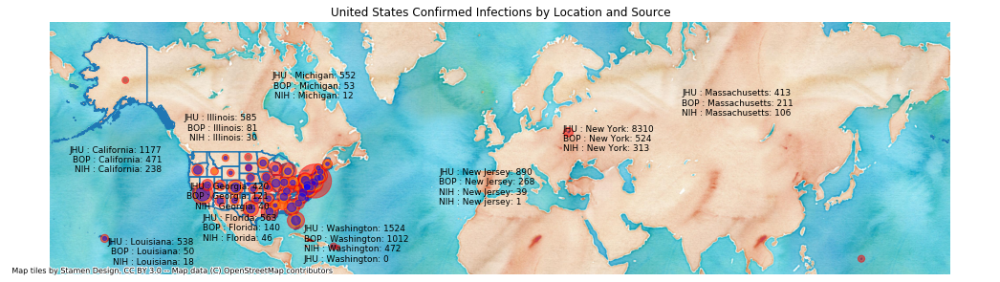
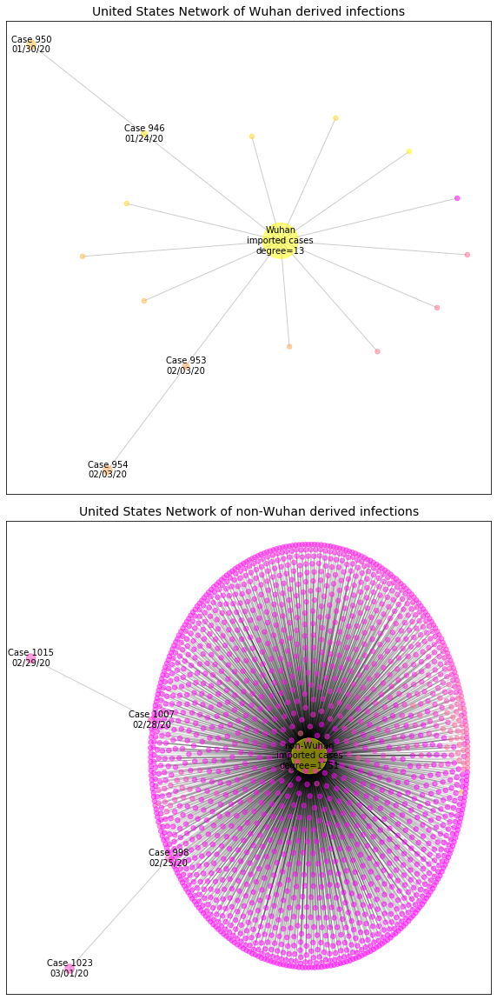

# United States
## NSSAC COVID-19 Summary
## 03/04/2020

### Situation Report:
#### Fig 1:

[Merged data csv](https://github.com/SchlittDataSci/SchlittDataSci.github.io/blob/master/data/tables/United_States_merged_daily.csv)

#### Table 1: Situation summary

|                           | NIHFogarty       | JHU                         | Tencent                       | BOP              |
|---------------------------|------------------|-----------------------------|-------------------------------|------------------|
| First update logged       | 01/13/20         | 01/22/20                    | 02/04/20                      | 01/12/20         |
| Last update logged        | 03/04/20         | 03/03/20                    | 03/04/20                      | 03/04/20         |
| Method                    | Public line list | Cases by day & country list | Daily cases in country scrape | Public line list |
| First known case          | 01/21/20         | 01/22/20                    | 02/04/20                      | 01/20/20         |
| Total confirmed cases     | 140              | 122                         | 60                            | 40               |
| New cases since yesterday | 10               |                             | 0                             |                  |
| Total suspected           |                  |                             | 0                             |                  |
| Total hospitalized        | 4                |                             |                               | 2                |
| Total recovered           |                  | 8                           | 3                             | 0                |
| Total deaths              | 0                | 7                           | 0                             | 2                |

Data sources: BOP, JHU, NIH-Fogarty, Tencent

[Sitrep csv](https://github.com/SchlittDataSci/SchlittDataSci.github.io/blob/master/data/tables/United_States_sitrep.csv)

### Geographic dispersal:
#### Fig 2:

#### Table 2: Confirmed cases by location

| source   | loc_name                                        |   confirmed |
|----------|-------------------------------------------------|-------------|
| NIH      | USA, United States                              |          44 |
| NIH      | California, United States                       |          37 |
| NIH      | Washington, United States                       |          29 |
| NIH      | New York, United States                         |           6 |
| NIH      | Illinois, United States                         |           4 |
| NIH      | Florida, United States                          |           3 |
| NIH      | Oregon, United States                           |           3 |
| NIH      | Georgia, United States                          |           2 |
| NIH      | Massachusetts, United States                    |           2 |
| NIH      | New Hampshire, United States                    |           2 |
| NIH      | Texas, United States                            |           2 |
| NIH      | Arizona, United States                          |           2 |
| NIH      | Rhode Island, United States                     |           2 |
| NIH      | North Carolina, United States                   |           1 |
| NIH      | Wisconsin, United States                        |           1 |
| JHU      | Unassigned Location (From Diamond Princess), US |          45 |
| JHU      | King County, WA, US                             |          21 |
| JHU      | Santa Clara, CA, US                             |          11 |
| JHU      | Snohomish County, WA, US                        |           6 |
| JHU      | Cook County, IL, US                             |           4 |
| JHU      | Washington County, OR, US                       |           2 |
| JHU      | Fulton County, GA, US                           |           2 |
| JHU      | Hillsborough, FL, US                            |           2 |
| JHU      | San Mateo, CA, US                               |           2 |
| JHU      | Grafton County, NH, US                          |           2 |
| JHU      | Providence, RI, US                              |           2 |
| JHU      | San Benito, CA, US                              |           2 |
| JHU      | San Diego County, CA, US                        |           2 |
| JHU      | Sacramento County, CA, US                       |           2 |
| JHU      | Norfolk County, MA, US                          |           1 |
| JHU      | Westchester County, NY, US                      |           1 |
| JHU      | Humboldt County, CA, US                         |           1 |
| JHU      | Tempe, AZ, US                                   |           1 |
| JHU      | Orange, CA, US                                  |           1 |
| JHU      | Los Angeles, CA, US                             |           1 |
| JHU      | Boston, MA, US                                  |           1 |
| JHU      | Madison, WI, US                                 |           1 |
| JHU      | San Antonio, TX, US                             |           1 |
| JHU      | Wake County, NC, US                             |           1 |
| JHU      | New York City, NY, US                           |           1 |
| JHU      | Placer County, CA, US                           |           1 |
| JHU      | Sarasota, FL, US                                |           1 |
| JHU      | Sonoma County, CA, US                           |           1 |
| JHU      | Umatilla, OR, US                                |           1 |
| JHU      | Berkeley, CA, US                                |           1 |
| JHU      | Maricopa County, AZ, US                         |           1 |
| JHU      | Travis, CA (From Diamond Princess), US          |           0 |
| JHU      | Omaha, NE (From Diamond Princess), US           |           0 |
| JHU      | Lackland, TX (From Diamond Princess), US        |           0 |
| BOP      | Washington, United States                       |          15 |
| BOP      | California, United States                       |          14 |
| BOP      | Oregon, United States                           |           2 |
| BOP      | Illinois, United States                         |           2 |
| BOP      | Massachusetts, United States                    |           2 |
| BOP      | Arizona, United States                          |           1 |
| BOP      | Wisconsin, United States                        |           1 |
| BOP      | North Carolina, United States                   |           1 |
| BOP      | New York, United States                         |           1 |
| BOP      | Texas, United States                            |           1 |

Data sources: BOP, JHU, Natural Earth, NIH-Fogarty, Tencent

[Case points geojson](https://github.com/SchlittDataSci/SchlittDataSci.github.io/blob/master/data/shapes/United_States_case_locs.geojson)

[Case admin1 locs geojson](https://github.com/SchlittDataSci/SchlittDataSci.github.io/blob/master/data/shapes/United_States_admin1_locs.geojson)

### Observed case clusters:
#### Fig 3:

Data source: NIH-Fogarty

#### Fig 4:

Data source: BOP

#### Fig 5:

Data source: NIH-Fogarty

### Data sources:
* **[BOP](https://github.com/beoutbreakprepared/nCoV2019)**
* **[JHU](https://github.com/CSSEGISandData/COVID-19)** 
* **[NIH-Fogarty](https://docs.google.com/spreadsheets/d/1jS24DjSPVWa4iuxuD4OAXrE3QeI8c9BC1hSlqr-NMiU/edit#gid=1187587451)** 
* **[Tencent](https://news.qq.com/zt2020/page/feiyan.htm)**
* **[Natural Earth](https://www.naturalearthdata.com/forums/forum/natural-earth-map-data/cultural-vectors/admin-1-states-provinces-and-their-boundaries/)**

<!-- Global site tag (gtag.js) - Google Analytics -->

