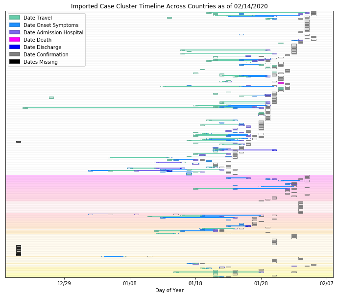

## 2019-nCoV Imported Case Cluster Viz (last updated 02/14/20 19:02)

### Reference

* [Readme](https://github.com/SchlittDataSci/SchlittDataSci.github.io/blob/master/README.md)

### Resources

* [Prepped line list](cleaned_line_list.csv)

* [BeOutbreakPrepared's public line list](https://github.com/beoutbreakprepared/nCoV2019)

* [Imported case origin curation sheet](https://docs.google.com/spreadsheets/d/1s2j-RmkO8C69HtrELpNMipkG5ftPJqCPEzGRAxIukFY/edit#gid=0)

* [Imported cases dashboard](https://datastudio.google.com/reporting/f6ad0988-f203-45f8-8d18-5d726c1d2d8b)

### All imported cases clusters

### Country reports
[Australia report](country_reports/Australia_report.md)

[Belgium report](country_reports/Belgium_report.md)

[Cambodia report](country_reports/Cambodia_report.md)

[Canada report](country_reports/Canada_report.md)

[Finland report](country_reports/Finland_report.md)

[France report](country_reports/France_report.md)

[Germany report](country_reports/Germany_report.md)

[India report](country_reports/India_report.md)

[Italy report](country_reports/Italy_report.md)

[Japan report](country_reports/Japan_report.md)

[Malaysia report](country_reports/Malaysia_report.md)

[Nepal report](country_reports/Nepal_report.md)

[Philippines report](country_reports/Philippines_report.md)

[Russia report](country_reports/Russia_report.md)

[Singapore report](country_reports/Singapore_report.md)

[South Korea report](country_reports/South%20Korea_report.md)

[Spain report](country_reports/Spain_report.md)

[Sri Lanka report](country_reports/Sri%20Lanka_report.md)

[Sweden report](country_reports/Sweden_report.md)

[Taiwan report](country_reports/Taiwan_report.md)

[Thailand report](country_reports/Thailand_report.md)

[UAE report](country_reports/UAE_report.md)

[United Kingdom report](country_reports/United%20Kingdom_report.md)

[United States report](country_reports/United%20States_report.md)

[Vietnam report](country_reports/Vietnam_report.md)

THE CONTENTS OF THIS WEBSITE, INCLUDING DATA, MAPS, PLOTS, COPYRIGHT 2020, UVA, ALL RIGHTS RESERVED, IS PROVIDED TO THE PUBLIC FOR RESEARCH AND ACADEMIC PURPOSES. THE WEBSITE USES A NUMBER OF OPEN SOURCE DATA SETS. UVA PROVIDES NO WARRANTIES, CLAIMS OR REPRESENTATIONS–WHETHER EXPRESS, IMPLIED, OR STATUTORY–WITH RESPECT TO THIS WEBSITE, INCLUDING, WITHOUT LIMITATION, WARRANTIES OF QUALITY, PERFORMANCE, NON–INFRINGEMENT, MERCHANTABILITY, OR FITNESS FOR A PARTICULAR PURPOSE, AND DISAVOWS ANY WARRANTIES CREATED BY COURSE OF DEALING, COURSE OF PERFORMANCE, OR TRADE USAGE.

James Schlitt 2020 UVA NSSAC