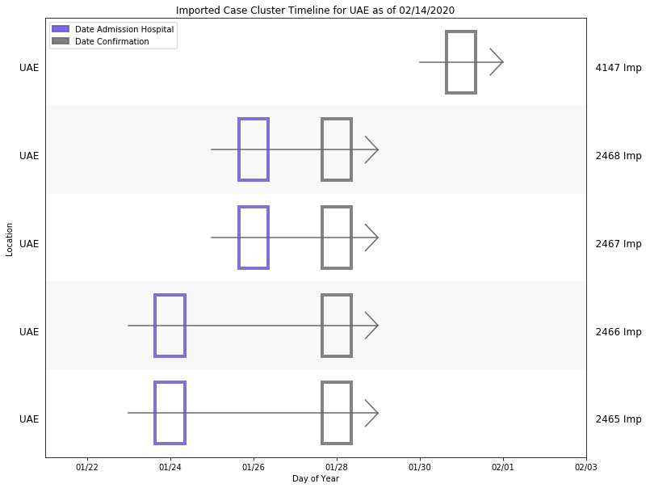

## 2019-nCoV Imported Case Cluster Viz (last updated 02/14/20 18:02)

### Reference

* [Readme](https://github.com/SchlittDataSci/SchlittDataSci.github.io/blob/master/README.md)

### Resources

* [Prepped line list](cleaned_line_list.csv)

* [BeOutbreakPrepared's public line list](https://github.com/beoutbreakprepared/nCoV2019)

* [Imported case origin curation sheet](https://docs.google.com/spreadsheets/d/1s2j-RmkO8C69HtrELpNMipkG5ftPJqCPEzGRAxIukFY/edit#gid=0)

* [Imported cases dashboard](https://datastudio.google.com/reporting/f6ad0988-f203-45f8-8d18-5d726c1d2d8b)

### Figures

All imported cases

Australia imported cases

Belgium imported cases

Cambodia imported cases

Canada imported cases

Finland imported cases

France imported cases

Germany imported cases

India imported cases

Italy imported cases

Japan imported cases

Malaysia imported cases

Nepal imported cases

Philippines imported cases

Russia imported cases

Singapore imported cases

South Korea imported cases

Spain imported cases

Sri Lanka imported cases

Sweden imported cases

Taiwan imported cases

Thailand imported cases

UAE imported cases

United Kingdom imported cases

United States imported cases

Vietnam imported cases

James Schlitt 2020 UVA NSSAC