## 2019-nCoV Imported Case Cluster Viz (last updated 02/27/20 17:02)

### Reference

* [Readme](https://github.com/SchlittDataSci/SchlittDataSci.github.io/blob/master/README.md)

### Resources

* [Prepped line list](cleaned_line_list.csv)

* [BeOutbreakPrepared's public line list](https://github.com/beoutbreakprepared/nCoV2019)

* [BOP Imported case origin curation sheet](https://docs.google.com/spreadsheets/d/1s2j-RmkO8C69HtrELpNMipkG5ftPJqCPEzGRAxIukFY/edit#gid=0)

* [Imported cases dashboard](https://datastudio.google.com/reporting/f6ad0988-f203-45f8-8d18-5d726c1d2d8b)

* [NSSAC prepared data](https://github.com/SchlittDataSci/SchlittDataSci.github.io/tree/master/data)

### All imported case clusters

### Country reports
  [Afghanistan](country_reports/Afghanistan_report.md)               [Algeria](country_reports/Algeria_report.md)             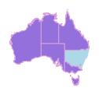  [Australia](country_reports/Australia_report.md)             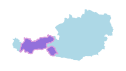  [Austria](country_reports/Austria_report.md)               [Bahrain](country_reports/Bahrain_report.md)

  [Belgium](country_reports/Belgium_report.md)             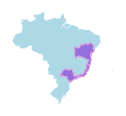  [Brazil](country_reports/Brazil_report.md)               [Cambodia](country_reports/Cambodia_report.md)               [Canada](country_reports/Canada_report.md)               [Croatia](country_reports/Croatia_report.md)

  [Egypt](country_reports/Egypt_report.md)               [Finland](country_reports/Finland_report.md)               [France](country_reports/France_report.md)               [Georgia](country_reports/Georgia_report.md)               [Germany](country_reports/Germany_report.md)

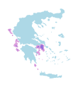  [Greece](country_reports/Greece_report.md)               [Hong Kong](country_reports/Hong_Kong_report.md)               [India](country_reports/India_report.md)             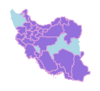  [Iran](country_reports/Iran_report.md)               [Israel](country_reports/Israel_report.md)

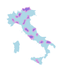  [Italy](country_reports/Italy_report.md)               [Japan](country_reports/Japan_report.md)               [Kuwait](country_reports/Kuwait_report.md)             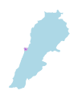  [Lebanon](country_reports/Lebanon_report.md)               [Malaysia](country_reports/Malaysia_report.md)

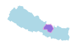  [Nepal](country_reports/Nepal_report.md)               [North Macedonia](country_reports/North_Macedonia_report.md)               [Norway](country_reports/Norway_report.md)               [Oman](country_reports/Oman_report.md)             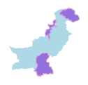  [Pakistan](country_reports/Pakistan_report.md)

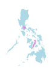  [Philippines](country_reports/Philippines_report.md)             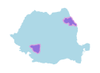  [Romania](country_reports/Romania_report.md)             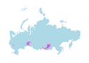  [Russia](country_reports/Russia_report.md)               [Singapore](country_reports/Singapore_report.md)               [South Korea](country_reports/South_Korea_report.md)

  [Spain](country_reports/Spain_report.md)               [Sri Lanka](country_reports/Sri_Lanka_report.md)               [Sweden](country_reports/Sweden_report.md)               [Switzerland](country_reports/Switzerland_report.md)               [Taiwan](country_reports/Taiwan_report.md)

  [Thailand](country_reports/Thailand_report.md)               [UAE](country_reports/UAE_report.md)               [United Arab Emirates](country_reports/United_Arab_Emirates_report.md)               [United Kingdom](country_reports/United_Kingdom_report.md)               [United States](country_reports/United_States_report.md)

  [Vietnam](country_reports/Vietnam_report.md)

THE CONTENTS OF THIS WEBSITE, INCLUDING DATA, MAPS, PLOTS, COPYRIGHT 2020, UVA, ALL RIGHTS RESERVED, IS PROVIDED TO THE PUBLIC FOR RESEARCH AND ACADEMIC PURPOSES. THE WEBSITE USES A NUMBER OF OPEN SOURCE DATA SETS. UVA PROVIDES NO WARRANTIES, CLAIMS OR REPRESENTATIONS–WHETHER EXPRESS, IMPLIED, OR STATUTORY–WITH RESPECT TO THIS WEBSITE, INCLUDING, WITHOUT LIMITATION, WARRANTIES OF QUALITY, PERFORMANCE, NON–INFRINGEMENT, MERCHANTABILITY, OR FITNESS FOR A PARTICULAR PURPOSE, AND DISAVOWS ANY WARRANTIES CREATED BY COURSE OF DEALING, COURSE OF PERFORMANCE, OR TRADE USAGE.

James Schlitt 2020 UVA NSSAC

<!-- Global site tag (gtag.js) - Google Analytics -->

